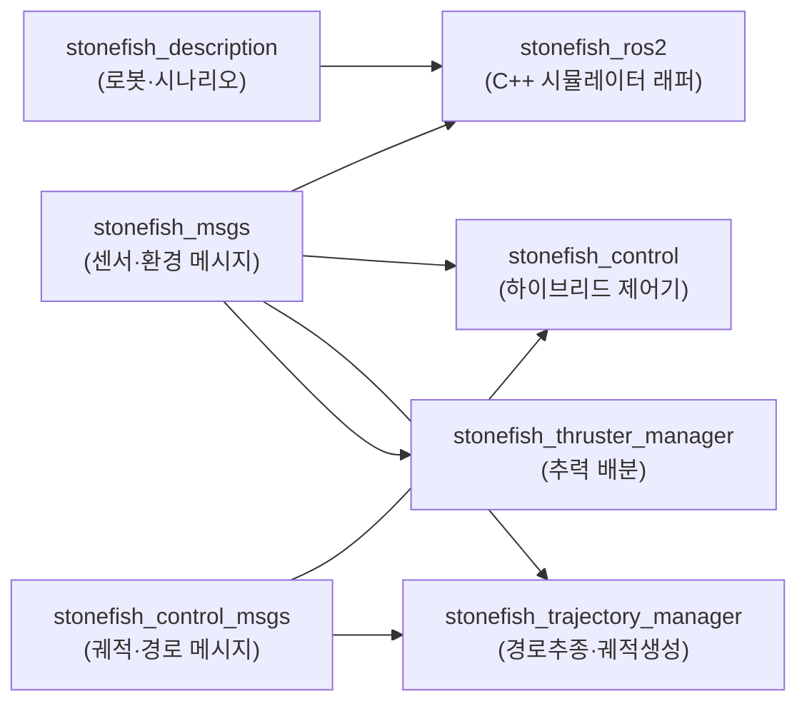
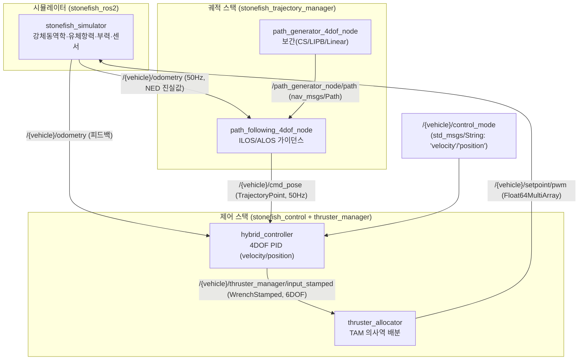

# 시스템 구조

이 페이지는 stonefish_sim을 구성하는 7개 ROS2 패키지의 역할·빌드타입, 패키지 의존 관계와 디렉토리 구조, 그리고 시뮬레이터-제어스택-궤적스택을 잇는 데이터 흐름과 LIVE 노드 6개를 개괄한다. 노드·토픽·서비스의 상세는 [nodes-topics.md](nodes-topics.md), 메시지·서비스 정의의 상세는 [messages.md](messages.md)에서 다룬다.

## 패키지 구성 (7개)

stonefish_sim은 메시지 정의, 로봇·환경 정의, C++ 시뮬레이터 래퍼, 그리고 Python 제어·추력·궤적 스택의 7개 ROS2 패키지로 이루어진다. 모든 패키지는 버전 `0.4.0`, 라이선스 GPL-3.0으로 통일되어 있다.

| 패키지 | 역할 | 빌드타입 |
|--------|------|---------|
| `stonefish_msgs` | DVL/INS/환경제어 등 메시지·서비스 정의 | `ament_cmake` |
| `stonefish_control_msgs` | 궤적/경로 메시지 정의 (TrajectoryPoint, Waypoint, GuidanceCommand) | `ament_cmake` |
| `stonefish_description` | 로봇모델(BlueROV2/BlueBoat), 시나리오, 환경 정의 | `ament_cmake` |
| `stonefish_ros2` | Stonefish C++ 시뮬레이터 래퍼 (센서/액추에이터 게이트웨이) | `ament_cmake` |
| `stonefish_control` | PID 기반 4DOF 하이브리드 제어기 (velocity/position 모드) | `ament_python` |
| `stonefish_thruster_manager` | TAM(Thruster Allocation Matrix) 기반 추력 배분 | `ament_python` |
| `stonefish_trajectory_manager` | ILOS/ALOS 경로추종 + 궤적생성 | `ament_python` |

근거: 각 패키지의 `package.xml` 전수 검토.

!!! note "메시지 패키지와 런타임 패키지의 분리"
    `stonefish_msgs`와 `stonefish_control_msgs`는 `ament_cmake`로 빌드되는 인터페이스(메시지/서비스) 전용 패키지다. 실제 노드 로직은 `ament_python` 패키지인 `stonefish_control`, `stonefish_thruster_manager`, `stonefish_trajectory_manager`에 있다. C++ 시뮬레이터 래퍼 `stonefish_ros2`는 별도로 `ament_cmake`로 빌드된다.

## 패키지 의존 관계

시뮬레이터(`stonefish_ros2`)는 로봇·환경 정의(`stonefish_description`)와 센서 메시지(`stonefish_msgs`)에 의존한다. 제어·추력·궤적 스택은 모두 Python 패키지로, 궤적 메시지(`stonefish_control_msgs`)와 센서 메시지(`stonefish_msgs`)를 인터페이스로 사용한다.



## 디렉토리 트리 (주요 항목)

```text
stonefish_sim/
├── stonefish_msgs/
│   ├── msg/        # DVL, DVLBeam, INS, NEDPose, ThrusterState, Int32Stamped, BeaconInfo (7개)
│   └── srv/        # SetWaveHeight, SetWindVelocity, SetOceanCurrent, SonarSettings, SonarSettings2 (5개)
├── stonefish_control_msgs/
│   ├── msg/        # TrajectoryPoint, Waypoint, Trajectory, WaypointSet, GuidanceCommand (5개)
│   └── srv/        # ResetTrajectory (1개)
├── stonefish_description/
│   ├── scenarios/  # *.scn (7개)
│   └── data/        # robots/{bluerov2,blueboat}/, worlds/, models/
├── stonefish_ros2/
│   ├── src/        # stonefish_simulator.cpp(GPU), stonefish_simulator_nogpu.cpp(CPU),
│   │              #   ROS2Interface.cpp, ROS2ScenarioParser.cpp, ROS2SimulationManager.cpp
│   └── launch/     # 4개
├── stonefish_control/
│   └── nodes/      # hybrid_controller_node.py(LIVE), position_controller_node.py(catalogue-only)
├── stonefish_thruster_manager/
│   └── nodes/      # thruster_allocator_node.py
└── stonefish_trajectory_manager/
    ├── nodes/             # path_generator_node.py, path_following_node.py
    ├── path_generator/    # cs / lipb / linear interpolator
    └── path_following/    # ilos / alos guidance
```

!!! note "LIVE 노드와 catalogue-only 노드"
    `stonefish_control/nodes/`에는 `hybrid_controller_node.py`(LIVE)와 `position_controller_node.py`(catalogue-only) 두 노드가 있으나, launch로 기동되는 LIVE 노드는 `hybrid_controller_node.py`뿐이다.

## 데이터 흐름

시뮬레이터(`stonefish_ros2`)는 진실값 상태(odometry)와 센서 데이터를 발행하고, 추력 입력을 수신한다. 궤적 스택은 경로를 생성·추종해 목표 자세(`cmd_pose`)를 만들고, 제어 스택은 이를 6DOF wrench로 변환하며, 추력 매니저는 wrench를 개별 추진기 PWM으로 배분해 다시 시뮬레이터로 돌려준다.



데이터 흐름의 핵심 경로를 요약하면 다음과 같다. 시뮬레이터는 `/{vehicle}/odometry`로 NED 진실값을 50Hz로 발행하며, 궤적 추종 노드는 이를 피드백으로 받아 LOS 기반 목표 자세 `/{vehicle}/cmd_pose`를 50Hz로 출력한다. 하이브리드 제어기는 odometry 피드백과 cmd_pose 목표로부터 6DOF wrench(`/{vehicle}/thruster_manager/input_stamped`)를 산출하고, 추력 매니저가 이를 TAM 의사역으로 8개 추진기 PWM(`/{vehicle}/setpoint/pwm`)으로 배분해 시뮬레이터로 환류한다. 제어 모드는 `/{vehicle}/control_mode` 토픽(`std_msgs/String`)으로 즉시 절환된다.

근거: `ROS2Interface.h:64-81`, `hybrid_controller_node.py:45`, `path_following_node.py:150`.

## LIVE 노드 (6개)

launch로 실제 기동되는 노드는 시뮬레이터 2종(GPU/CPU)과 제어·궤적·추력 노드 4종이다.

| 노드명 | 패키지 | 실행 경로 | 기동 |
|--------|--------|---------|------|
| `stonefish_simulator` | `stonefish_ros2` | `src/stonefish_simulator.cpp` | `simulator.launch.py` |
| `stonefish_simulator_nogpu` | `stonefish_ros2` | `src/stonefish_simulator_nogpu.cpp` | `gpu:=false` |
| `hybrid_controller` | `stonefish_control` | `nodes/hybrid_controller_node.py:16` | `control.launch.py` |
| `path_generator_4dof_node` | `stonefish_trajectory_manager` | `nodes/path_generator_node.py:40` | `path.launch.py` |
| `path_following_4dof_node` | `stonefish_trajectory_manager` | `nodes/path_following_node.py:39` | `path.launch.py` |
| `thruster_allocator` | `stonefish_thruster_manager` | `nodes/thruster_allocator_node.py:39` | `thruster_manager.launch.py` |

각 노드의 역할을 요약하면, `stonefish_simulator`/`stonefish_simulator_nogpu`는 Stonefish 물리 엔진을 구동해 센서 데이터를 발행하고 액추에이터 입력을 수신하는 게이트웨이다. `hybrid_controller`는 4DOF 선형 PID(anti-windup back-calculation 포함)로 velocity/position 모드를 처리한다. `path_generator_4dof_node`는 경유점을 CS/LIPB/Linear로 보간해 경로를 생성하고, `path_following_4dof_node`는 ILOS/ALOS 가이던스로 경로를 추종한다. `thruster_allocator`는 TAM 의사역으로 6DOF wrench를 8개 추진기 출력으로 배분한다.

!!! tip "GPU/CPU 시뮬레이터 선택"
    `stonefish_simulator`(GPU)와 `stonefish_simulator_nogpu`(CPU)는 같은 시뮬레이션 매니저를 공유하되 렌더링 백엔드만 다르다. `gpu:=false` 인자로 CPU(headless nogpu) 버전을 기동할 수 있다.

세부 토픽·서비스 인터페이스는 [nodes-topics.md](nodes-topics.md), 메시지·서비스 필드 정의는 [messages.md](messages.md)를 참조한다.
