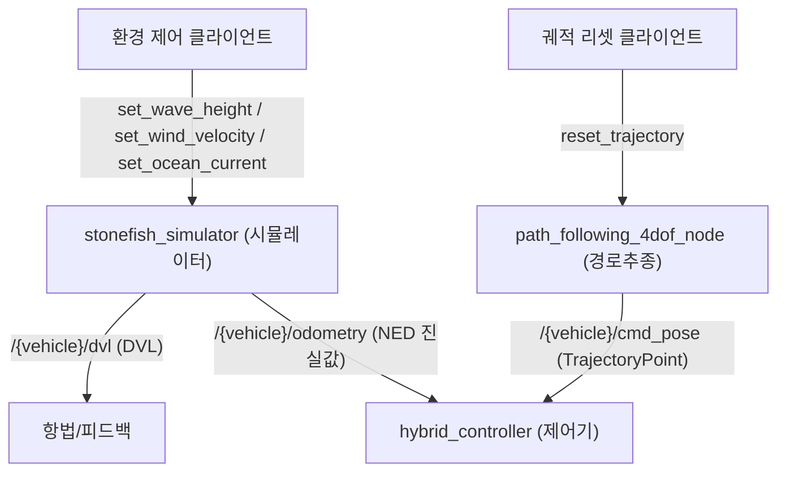

# 메시지·서비스

이 페이지는 `stonefish_msgs`와 `stonefish_control_msgs` 두 패키지가 정의하는 메시지·서비스 타입의 필드 구조와 좌표계 규약을 정리한다. 센서 데이터(DVL, INS), 자세 표현(NEDPose), 궤적·경유점(TrajectoryPoint, Waypoint), 그리고 환경 제어·궤적 리셋 서비스가 대상이다.

## 패키지 개요

두 메시지 패키지는 모두 `ament_cmake` 빌드 타입이며 버전 `0.4.0`, 라이선스 GPL-3.0이다(`*/package.xml` 전수 검토 기준).

| 패키지 | 역할 | msg 개수 | srv 개수 |
|--------|------|---------|---------|
| `stonefish_msgs` | DVL/INS 센서, 환경 제어 등 시뮬레이터 측 메시지·서비스 | 7 | 5 |
| `stonefish_control_msgs` | 궤적/경로 메시지 정의 (`TrajectoryPoint`, `Waypoint`, `GuidanceCommand` 등) | 5 | 1 |

`stonefish_msgs`의 msg는 `DVL`, `DVLBeam`, `INS`, `NEDPose`, `ThrusterState`, `Int32Stamped`, `BeaconInfo`이고, srv는 `SetWaveHeight`, `SetWindVelocity`, `SetOceanCurrent`, `SonarSettings`, `SonarSettings2`이다. `stonefish_control_msgs`의 msg는 `TrajectoryPoint`, `Waypoint`, `Trajectory`, `WaypointSet`, `GuidanceCommand`이고, srv는 `ResetTrajectory`이다.

!!! warning "좌표계 규약 — NED / FRD body"
    이 패키지들의 메시지는 REP-103 변형인 **NED**(North-East-Down) 규약을 따른다(CONVENTIONS, suffix `_ned`). 위치·자세 필드(`INS.pose`, `NEDPose`, `TrajectoryPoint.pose`)는 NED 월드 프레임이고, 속도·가속도 필드(`TrajectoryPoint.velocity`, `TrajectoryPoint.acceleration`)는 **FRD body**(Forward-Right-Down 차체) 프레임이다. 두 프레임을 혼동하면 제어 부호가 뒤집힌다.

    또한 쿼터니언은 내부적으로 `[w, x, y, z]` 순서를 쓰지만 ROS 메시지(`geometry_msgs/Quaternion`)에서는 `[x, y, z, w]` 순서로 노출된다(CONVENTIONS). 변환 코드에서 순서를 맞춰야 한다.

## stonefish_msgs 메시지

### DVL.msg

도플러 속도 로그(Doppler Velocity Log) 센서 출력. 시뮬레이터가 `/{vehicle}/dvl` 토픽으로 10Hz에 발행한다.

| 필드 | 타입 | 단위 | 설명 |
|------|------|------|------|
| `header` | `std_msgs/Header` | — | 타임스탬프·프레임 |
| `velocity` | `geometry_msgs/Vector3` | m/s | 측정 속도 |
| `velocity_covariance` | `float64[9]` | — | 속도 공분산 (3×3 평탄화) |
| `altitude` | `float64` | m | 해저까지 고도 |
| `beams` | `DVLBeam[]` | — | 개별 빔 측정 배열 |

근거: `DVL.msg`, 토픽 발행은 `ROS2Interface.h:64-81`.

### INS.msg

관성 항법 시스템(Inertial Navigation System) 출력. 자세(`pose`)는 NED 프레임이다.

| 필드 | 타입 | 단위 | 프레임 | 설명 |
|------|------|------|--------|------|
| `header` | `std_msgs/Header` | — | — | 타임스탬프·프레임 |
| `latitude` | `float64` | deg | — | 위도 |
| `longitude` | `float64` | deg | — | 경도 |
| `origin_latitude` | `float64` | deg | — | NED 원점 위도 |
| `origin_longitude` | `float64` | deg | — | NED 원점 경도 |
| `pose` | `NEDPose` | — | NED | 위치·자세 |
| `pose_variance` | `NEDPose` | — | NED | 위치·자세 분산 |
| `altitude` | `float64` | m | — | 고도 |
| `body_velocity` | `geometry_msgs/Vector3` | m/s | body | 차체 선속도 |
| `rpy_rate` | `geometry_msgs/Vector3` | rad/s | body | 롤·피치·요 각속도 |

### NEDPose.msg

NED 프레임 위치·자세를 전달하는 경량 메시지. 위치는 north/east/down, 자세는 roll/pitch/yaw 오일러각이다.

| 필드 | 타입 | 단위 | 설명 |
|------|------|------|------|
| `north` | `float64` | m | 북쪽 위치 |
| `east` | `float64` | m | 동쪽 위치 |
| `down` | `float64` | m | 아래쪽 위치 |
| `roll` | `float64` | rad | 롤 |
| `pitch` | `float64` | rad | 피치 |
| `yaw` | `float64` | rad | 요 |

## stonefish_control_msgs 메시지

### TrajectoryPoint.msg

궤적상의 한 점을 표현한다. 위치/자세는 NED, 속도/가속도는 FRD body 프레임이다. ILOS guidance 출력으로 `/{vehicle}/cmd_pose` 토픽에 50Hz로 발행된다(`path_following_node.py:150`).

| 필드 | 타입 | 프레임 | 설명 |
|------|------|--------|------|
| `header` | `std_msgs/Header` | — | 타임스탬프·프레임 |
| `pose` | `geometry_msgs/Pose` | NED | 목표 자세(위치+방향) |
| `velocity` | `geometry_msgs/Twist` | FRD body | 목표 속도 |
| `acceleration` | `geometry_msgs/Accel` | body | 목표 가속도 |

!!! note "FRD body 속도/가속도"
    `velocity`와 `acceleration`은 차체 고정(FRD body) 프레임이다. `pose`의 NED 월드 프레임과 다른 좌표계이므로, 소비 측에서 둘을 같은 프레임으로 변환한 뒤 사용해야 한다.

### Waypoint.msg

경로 경유점 하나를 정의한다. 위치는 NED 프레임, heading은 yaw(rad)이다.

| 필드 | 타입 | 단위 | 설명 |
|------|------|------|------|
| `header` | `std_msgs/Header` | — | 타임스탬프·프레임 |
| `point` | `geometry_msgs/Point` | m (NED) | 경유점 위치 |
| `heading` | `float64` | rad | 목표 yaw |
| `max_forward_speed` | `float64` | m/s | 최대 전진 속도 |
| `use_fixed_heading` | `bool` | — | 고정 heading 사용 여부 |
| `radius_of_acceptance` | `float64` | m | 도달 판정 반경 |

!!! warning "Waypoint __hash__ 미구현 (latent)"
    `Waypoint` 타입에는 `__hash__`가 정의되어 있지 않다(P4_FLAGS #8, latent). 경유점을 집합/딕셔너리 키로 쓰려는 코드를 추가할 때 해시 동작에 주의한다.

## 서비스

### stonefish_msgs/srv — 환경 제어

세 서비스는 시뮬레이터의 해양 환경 파라미터를 런타임에 변경한다. 요청/응답 형태와 용도는 다음과 같다.

| 서비스 | 토픽 | 요청 필드 | 응답 필드 | 용도 |
|--------|------|----------|----------|------|
| `SetWaveHeight` | `/stonefish_ros2/stonefish_simulator/set_wave_height` | `height` (`float64`) | `success`, `message` | 파고 설정 |
| `SetWindVelocity` | `/stonefish_ros2/stonefish_simulator/set_wind_velocity` | `x`, `y`, `z` (`float64`, NED) | `success`, `message` | 풍속 벡터 설정 |
| `SetOceanCurrent` | `/stonefish_ros2/stonefish_simulator/set_ocean_current` | `current_index` (`int32`), `enable` (`bool`), `velocity` (`float64[3]`) | `success`, `message` | 해류 활성화·속도 설정 |

근거: `stonefish_msgs/srv`, 서비스 등록 `ROS2SimulationManager.cpp:157-159`.

### stonefish_control_msgs/srv — 궤적 리셋

| 서비스 | 토픽 | 요청 | 응답 | 용도 |
|--------|------|------|------|------|
| `ResetTrajectory` | `/{vehicle}/reset_trajectory` | (empty) | `success`, `message` | 진행 중인 궤적 추종 상태 초기화 |

!!! tip "환경 제어 서비스 호출 예시"
    파고를 설정하려면 다음과 같이 호출한다.

    ```bash
    ros2 service call /stonefish_ros2/stonefish_simulator/set_wave_height stonefish_msgs/srv/SetWaveHeight "{height: 0.5}"
    ```

## 데이터 흐름 요약

시뮬레이터가 센서 메시지를 발행하고, 경로 추종 노드가 궤적 메시지를 생성하며, 서비스로 환경을 제어하는 관계는 다음과 같다.



근거: 토픽 매핑 `ROS2Interface.h:64-81`, `hybrid_controller_node.py:45`, `path_following_node.py:150`.

## 관련 문서

- 좌표계·게인·제어 모드 등 제어기 동작은 [하이브리드 제어기](../methodology/control.md) 참고.
- 노드·토픽 전체 구조는 [노드와 토픽](./nodes-topics.md) 참고.
