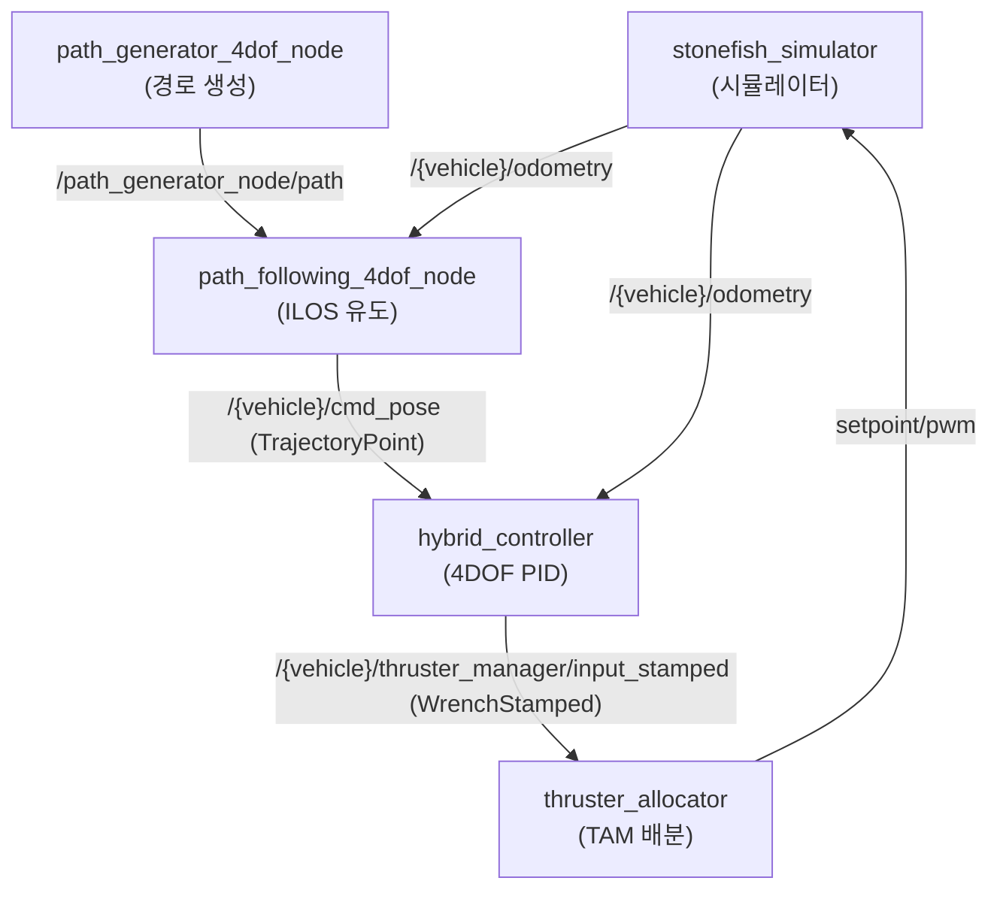

# 노드와 토픽

이 페이지는 stonefish_sim에서 실행되는 LIVE 노드 6개와 이들이 주고받는 주요 토픽, 그리고 `control_mode` 토픽을 통한 제어 모드 전환을 정리한다.

## LIVE 노드 6개

다음 6개 노드가 실제로 기동되는 LIVE 노드다. 나머지 `position_controller_node.py`는 catalogue-only로 기동되지 않는다.

| 노드명 | 패키지 | 실행 경로 (파일:라인) | 기동 launch |
|--------|--------|---------------------|-------------|
| `stonefish_simulator` | stonefish_ros2 | `src/stonefish_simulator.cpp` | `simulator.launch.py` |
| `stonefish_simulator_nogpu` | stonefish_ros2 | `src/stonefish_simulator_nogpu.cpp` | `simulator.launch.py gpu:=false` |
| `hybrid_controller` | stonefish_control | `nodes/hybrid_controller_node.py:16` | `control.launch.py` |
| `path_generator_4dof_node` | stonefish_trajectory_manager | `nodes/path_generator_node.py:40` | `path.launch.py` |
| `path_following_4dof_node` | stonefish_trajectory_manager | `nodes/path_following_node.py:39` | `path.launch.py` |
| `thruster_allocator` | stonefish_thruster_manager | `nodes/thruster_allocator_node.py:39` | `thruster_manager.launch.py` |

`stonefish_simulator`와 `stonefish_simulator_nogpu`는 각각 GPU 렌더 경로(`stonefish_simulator.cpp`)와 CPU/headless 경로(`stonefish_simulator_nogpu.cpp`)에 대응한다. 둘 중 어느 것을 띄울지는 `simulator.launch.py`의 boolean 인자 `gpu`로 정한다(기본 `true`, `simulator.launch.py:56`). `gpu:=false`를 주면 headless nogpu 빌드가 실행된다. 렌더 화질을 정하는 `rendering_quality`(low/medium/high)는 이와 **별개**의 인자이며 GPU 빌드에서만 적용된다.

!!! note "전체 기동"
    `bringup.launch.py`는 내부적으로 simulator + control + path + thruster_manager를 함께 띄운다.
    ```bash
    ros2 launch stonefish_ros2 bringup.launch.py vehicle_name:=bluerov2 scenario:=bluerov2_infrastructure
    ```

## Publish 토픽

시뮬레이터(`stonefish_simulator`)는 센서 진실값과 측정값을 발행하며, 제어/유도 노드는 명령 토픽을 발행한다. 근거: `ROS2Interface.h:64-81`, `hybrid_controller_node.py:45`, `path_following_node.py:150`.

| 토픽 | 타입 | 주파수 | 비고 |
|------|------|--------|------|
| `/{vehicle}/odometry` | `nav_msgs/Odometry` | 50Hz | NED 진실값 |
| `/{vehicle}/imu` | `sensor_msgs/Imu` | 50Hz | |
| `/{vehicle}/pressure` | `sensor_msgs/FluidPressure` | 10Hz | |
| `/{vehicle}/dvl` | `stonefish_msgs/DVL` | 10Hz | |
| `/{vehicle}/fls/image` | (소나) | — | 전방주시 소나 |
| `/{vehicle}/camera_*/image_color` | (카메라) | — | |
| `/path_generator_node/path` | `nav_msgs/Path` | — | 생성 경로 |
| `/{vehicle}/cmd_pose` | `TrajectoryPoint` | 50Hz | ILOS 출력(목표 자세) |

## Subscribe 토픽

제어 루프와 유도 루프는 피드백·목표·모드 토픽을 구독한다. 근거: 분석 사실 2.2절.

| 토픽 | 타입 | 구독 노드 용도 |
|------|------|--------------|
| `/{vehicle}/odometry` | `nav_msgs/Odometry` | 상태 피드백 |
| `/{vehicle}/cmd_pose` | `TrajectoryPoint` | 제어 목표 자세 |
| `/{vehicle}/thruster_manager/input_stamped` | `geometry_msgs/WrenchStamped` | 6DOF 렌치 입력 |
| `/path_generator_node/path` | `nav_msgs/Path` | 추종할 경로 |
| `/{vehicle}/control_mode` | `std_msgs/String` | `'velocity'` / `'position'` 모드 전환 |

## 토픽 연결 그래프

생성된 경로가 유도 노드를 거쳐 명령 자세가 되고, 하이브리드 제어기가 이를 렌치로 변환해 추력 배분으로 흘러가는 흐름이다.



## control_mode 토픽으로 모드 전환

`hybrid_controller`는 `/{vehicle}/control_mode` 토픽(`std_msgs/String`)으로 `'velocity'`와 `'position'` 두 모드를 즉시 전환한다. 시작 모드는 `initial_mode` 파라미터(기본값 `'velocity'`)로 정한다.

velocity 모드는 경로추종에 쓰이며 빠르고 반응적이고(큰 포화 한계 `max_force` 800N·`max_torque` 160Nm, 낮은 `integral_safety_factor` 0.5), position 모드는 위치 유지에 쓰이며 정밀하고 안정적이다(높은 `Kp`, 낮은 `Ki`, `integral_safety_factor` 2.0). position 모드의 포화 한계는 코드 기본값(`max_force` 200N·`max_torque` 50Nm)과 YAML 값(800N·160Nm)이 불일치하며(아래 P4_FLAGS 참조), 와일드카드 매치로 YAML이 로드되므로 실행 시에는 YAML 값이 적용된다.

!!! warning "모드 전환 시 적분 리셋"
    `control_mode` 토픽으로 모드를 절환하면 적분기가 리셋된다. velocity와 position 모드는 게인·`integral_safety_factor`가 서로 다르므로(velocity=빠름·반응적, position=정밀·안정), 전환 직후 제어 특성이 바뀐다.

!!! note "미해결 이슈 (P4_FLAGS)"
    position 모드의 포화 한계가 `hybrid_controller.yaml`(800N/160Nm)과 코드 `declare_parameter` 기본값(200N/50Nm)에서 서로 다르나 현재는 문서화만 된 상태다.
