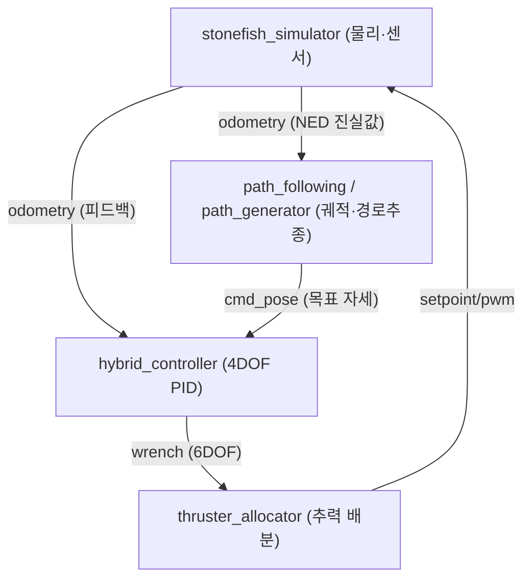

# 개요와 빠른 시작

이 페이지는 `stonefish_sim`을 처음 접하는 사용자가 5분 안에 전체 그림을 잡도록, 프로젝트의 목적과 핵심 구성요소, 지원 차량(BlueROV2·BlueBoat), 그리고 가장 빠른 실행 경로(`bringup.launch.py` 한 줄)를 소개한다. 상세 설치는 [installation.md](installation.md), 상세 실행은 [running.md](running.md)로 이어진다.

## stonefish_sim이란

`stonefish_sim`은 Stonefish 물리 엔진 위에 ROS2 인터페이스를 얹어, 수중·수상 로봇의 센서·액추에이터 시뮬레이션부터 제어·궤적·추력 배분까지를 하나의 스택으로 묶은 ROS2 워크스페이스다. Stonefish C++ 시뮬레이터는 강체동역학에 유체 항력·부력·센서 시뮬레이션을 더해 물리 세계를 재현하고(`stonefish_simulator.cpp:1-120`), 그 위의 ROS2 노드들이 제어 루프를 닫는다.

7개의 ROS2 패키지로 구성되며 모두 버전 `0.4.0`, 라이선스는 GPL-3.0이다(`*/package.xml`).

| 패키지 | 역할 | 빌드타입 |
|--------|------|---------|
| `stonefish_msgs` | DVL/INS/환경제어 등 메시지·서비스 정의 | `ament_cmake` |
| `stonefish_control_msgs` | 궤적/경로 메시지 정의(`TrajectoryPoint`, `Waypoint`, `GuidanceCommand`) | `ament_cmake` |
| `stonefish_description` | 로봇모델(BlueROV2/BlueBoat)·시나리오·환경 정의 | `ament_cmake` |
| `stonefish_ros2` | Stonefish C++ 시뮬레이터 래퍼(센서/액추에이터 게이트웨이) | `ament_cmake` |
| `stonefish_control` | PID 기반 4DOF 하이브리드 제어기(velocity/position 모드) | `ament_python` |
| `stonefish_thruster_manager` | TAM(Thruster Allocation Matrix) 기반 추력 배분 | `ament_python` |
| `stonefish_trajectory_manager` | ILOS/ALOS 경로추종 + 궤적생성 | `ament_python` |

## 핵심 구성요소

스택은 크게 네 갈래로 나뉜다. 시뮬레이터가 물리 세계와 센서 진실값을 생성하고, 궤적 관리자가 목표 자세를 산출하며, 제어기가 6DOF 렌치(wrench)를 계산하고, 추력 관리자가 그 렌치를 개별 추진기 출력으로 배분한다.



각 구성요소의 역할을 요약하면 다음과 같다.

- **시뮬레이터** — `stonefish_ros2`. `.scn` 시나리오(XML)를 파싱해 로봇·지형·센서를 구성하고, `StepSimulation` 루프에서 센서 데이터를 발행하고 액추에이터 입력을 수신한다(`ROS2Interface.h:59-85`). `/{vehicle}/odometry`(50Hz, NED 진실값), `/{vehicle}/imu`, `/{vehicle}/dvl`, 소나·카메라 영상을 발행한다. GPU 렌더링(`stonefish_simulator.cpp`)과 CPU 전용(`stonefish_simulator_nogpu.cpp`) 두 변형을 제공한다.
- **궤적/경로추종** — `stonefish_trajectory_manager`. 경유점으로부터 경로를 보간(Cubic Spline / LIPB / Linear)하고, ILOS/ALOS 가이던스로 경로를 추종하며 목표 자세 `/{vehicle}/cmd_pose`(`TrajectoryPoint`)를 산출한다(`path_following_node.py:39`, `path_generator_node.py:40`).
- **제어기** — `stonefish_control`. 4DOF 선형 PID에 anti-windup back-calculation을 더한 하이브리드 제어기로, velocity 모드와 position 모드를 `/{vehicle}/control_mode` 토픽으로 즉시 절환한다(`hybrid_controller_node.py:16`).
- **추력 배분** — `stonefish_thruster_manager`. TAM(Thruster Allocation Matrix)의 의사역행렬로 6DOF 렌치를 8개 추진기의 최소노름 해로 배분한다(`thruster_allocator_node.py:39`).

## 지원 차량: BlueROV2와 BlueBoat

`stonefish_description`은 BlueROV2와 BlueBoat 두 로봇 모델을 제공한다(`data/robots/{bluerov2,blueboat}/`). 기본 차량은 `bluerov2`이며, 제어기·경로추종·추력 관리자 모두 `vehicle_name` 파라미터의 기본값이 `'bluerov2'`다(`hybrid_controller_node.py:52`, `path_following_node.py:42`, `thruster_allocator_node.py`). BlueROV2의 동역학 파라미터는 `dynamics_params.yaml`에 정의되어 있다(질량 `20.131kg`, 중성부력, 8추진기 구성의 `TAM.yaml` 6×8 배분행렬).

!!! note "차량 전환"
    대부분의 launch 파일은 `vehicle_name:=` 인자로 차량을 선택한다. 차량 이름은 토픽 네임스페이스(`/{vehicle}/...`)로도 쓰이므로, 같은 launch 안에서 일관되게 지정해야 한다.

## 가장 빠른 실행 경로

설치와 빌드(`colcon build --symlink-install` 후 `source install/setup.bash`)를 마쳤다면, 전체 통합 스택은 단 한 줄로 띄울 수 있다. `bringup.launch.py`가 내부에서 시뮬레이터·제어·경로·추력 관리자를 한꺼번에 기동한다(`sim_analysis` 5.2).

```bash
ros2 launch stonefish_ros2 bringup.launch.py vehicle:=bluerov2
```

이 한 줄로 `stonefish_simulator` + `hybrid_controller` + `path_generator_4dof_node` / `path_following_4dof_node` + `thruster_allocator`가 함께 올라온다.

개별 구성요소만 따로 실행하려면 다음 launch들을 쓴다.

| 목적 | 명령 |
|------|------|
| 시뮬레이터만 | `ros2 launch stonefish_ros2 bluerov2.launch.py` |
| 제어기만 | `ros2 launch stonefish_control control.launch.py vehicle_name:=bluerov2 use_sim_time:=false` |
| 경로(생성+추종) | `ros2 launch stonefish_trajectory_manager path.launch.py vehicle_name:=bluerov2 use_sim_time:=true` |
| 추력 관리자만 | `ros2 launch stonefish_thruster_manager thruster_manager.launch.py` |

!!! tip "GPU가 없는 환경"
    시뮬레이터를 CPU 전용으로 띄우려면 `gpu:=false` 인자를 준다. 그러면 GPU 렌더링 노드(`stonefish_simulator`) 대신 CPU 변형(`stonefish_simulator_nogpu`)이 기동된다.

!!! warning "Stonefish 라이브러리 선행 설치 필요"
    `stonefish_ros2`는 Stonefish C++ 라이브러리(v1.3.0+, HERO-Lab-POSTECH/stonefish)에 의존한다. 이 라이브러리를 `cmake` + `make install`로 먼저 설치해야 워크스페이스 빌드가 성공한다. 자세한 절차는 [installation.md](installation.md)를 참고한다.

## 다음 단계

- 의존성·Stonefish 라이브러리·빌드 절차의 상세는 [installation.md](installation.md)에서 확인한다.
- launch 인자, 시나리오 선택, RViz 시각화 등 실행 시나리오의 상세는 [running.md](running.md)에서 확인한다.
