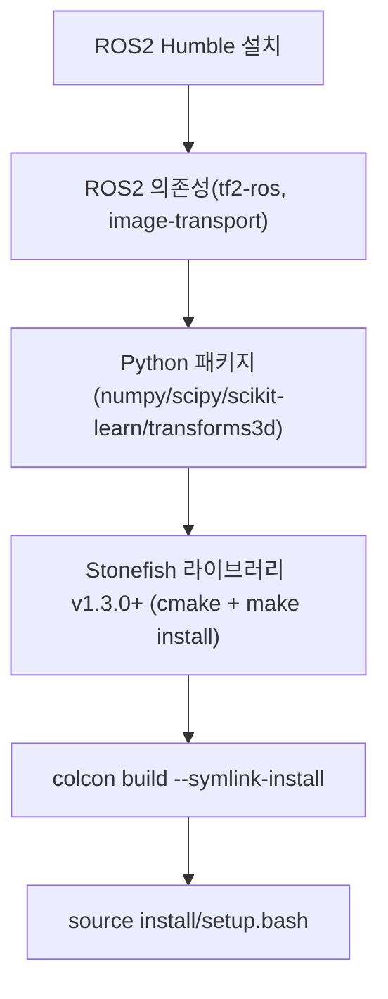

# 설치와 빌드

이 페이지는 `stonefish_sim`의 의존성 설치부터 `colcon` 빌드와 환경 source까지의 단계를 정리한다.

`stonefish_sim`은 ROS2 Humble 위에서 동작하는 7개 패키지 워크스페이스이며, C++ 시뮬레이터 래퍼(`stonefish_ros2`)가 별도 설치된 Stonefish 라이브러리에 의존한다. 따라서 빌드 전에 ROS2와 Python 의존성, 그리고 Stonefish 라이브러리를 먼저 설치해야 한다.

## 설치 흐름



## 의존성 목록

`README.md:5-44`에 정리된 빌드 의존성은 아래와 같다.

| 구분 | 항목 | 비고 |
|------|------|------|
| ROS2 | `ros-humble-desktop` | ROS2 Humble |
| ROS2 라이브러리 | `tf2-ros` | TF 변환 |
| ROS2 라이브러리 | `image-transport` | 카메라/소나 이미지 전송 |
| Python | `numpy` | 의사역(thruster allocation) 등 수치 연산 |
| Python | `scipy` | 보간·수치 계산 |
| Python | `scikit-learn` | |
| Python | `transforms3d` | 쿼터니언/좌표 변환 |
| 외부 C++ | Stonefish 라이브러리 v1.3.0+ | `HERO-Lab-POSTECH/stonefish`, `cmake` + `make install` |

!!! note "Stonefish 라이브러리는 ROS2 패키지가 아니다"
    Stonefish 라이브러리(`HERO-Lab-POSTECH/stonefish`)는 colcon 워크스페이스 바깥에서 `cmake` + `make install`로 시스템에 먼저 설치하는 별도 C++ 라이브러리다. `stonefish_ros2` 패키지가 이 라이브러리를 래핑하여 센서/액추에이터 게이트웨이로 사용한다.

## 단계별 설치

### 1. ROS2 Humble 설치

ROS2 Humble 데스크톱 구성을 설치한다.

```bash
sudo apt install ros-humble-desktop
```

### 2. ROS2 의존성 설치

`tf2-ros`와 `image-transport`를 설치한다.

```bash
sudo apt install ros-humble-tf2-ros ros-humble-image-transport
```

### 3. Python 패키지 설치

`stonefish_control`, `stonefish_thruster_manager`, `stonefish_trajectory_manager`(모두 `ament_python` 빌드타입)가 사용하는 Python 의존성을 설치한다.

```bash
pip install numpy scipy scikit-learn transforms3d
```

### 4. Stonefish 라이브러리(v1.3.0+) 설치

`HERO-Lab-POSTECH/stonefish` 라이브러리를 v1.3.0 이상으로 받아 `cmake` + `make install`로 설치한다.

```bash
git clone https://github.com/HERO-Lab-POSTECH/stonefish.git
cd stonefish
mkdir build && cd build
cmake ..
make -j$(nproc)
sudo make install
```

!!! warning "버전 요구사항"
    Stonefish 라이브러리는 v1.3.0 이상이어야 한다(`README.md:5-44`). 더 낮은 버전에서는 `stonefish_ros2`의 시뮬레이터 래퍼가 기대하는 인터페이스와 맞지 않을 수 있다.

### 5. colcon 빌드

워크스페이스 루트(7개 패키지를 포함하는 디렉토리)에서 `colcon build`를 실행한다. `--symlink-install`을 사용하면 Python 노드와 설정 파일을 재빌드 없이 수정 반영할 수 있다.

```bash
colcon build --symlink-install
```

### 6. 환경 source

빌드 산출물(`install/`)을 현재 셸에 등록한다.

```bash
source install/setup.bash
```

## 빌드 검증

source가 끝나면 노드를 launch하여 빌드를 확인할 수 있다. 가장 단순한 검증은 시뮬레이터만 기동하는 것이다(`README` 및 launch 정의 기준).

```bash
ros2 launch stonefish_ros2 bluerov2.launch.py
```

전체 스택(시뮬레이터 + 제어 + 경로 + thruster manager)을 한 번에 기동하려면 `bringup.launch.py`를 사용한다.

```bash
ros2 launch stonefish_ros2 bringup.launch.py vehicle:=bluerov2
```

!!! tip "새 터미널마다 source가 필요하다"
    `source install/setup.bash`는 현재 셸에만 적용된다. 새 터미널을 열 때마다 다시 source해야 `ros2 launch`로 패키지를 찾을 수 있다. `--symlink-install`로 빌드한 경우에도 Python 노드/설정 변경은 source된 환경에서 바로 반영되지만, 새 셸에서는 source 자체를 다시 해야 한다.

!!! warning "source를 빼먹으면 패키지를 찾지 못한다"
    빌드는 성공했는데 `ros2 launch`가 패키지를 찾지 못한다면, 대부분 `install/setup.bash`를 source하지 않았기 때문이다. 빌드 검증 전에 source가 선행되어야 한다.

## 테스트 실행

Python 노드의 단위 테스트는 `pytest`로 실행한다.

```bash
pytest -v
```

!!! note "테스트는 패키지를 직접 import하지 않는다"
    루트 `conftest.py`의 `load_module()` fixture는 모듈을 파일 경로로 직접 로드한다(`conftest.py:1-23`). 이는 ROS/gtsam 오염을 피하기 위한 것으로, 테스트가 패키지를 import하지 않고도 노드 로직을 검증할 수 있게 한다. 현재 기준 `pytest`는 42개 테스트를 통과한다(CHANGELOG v0.4.0).

## 다음 단계

설치가 끝나면 실행 launch와 RViz 시각화로 넘어갈 수 있다. 노드·토픽·파라미터의 상세는 각 방법론 페이지를 참고한다.
