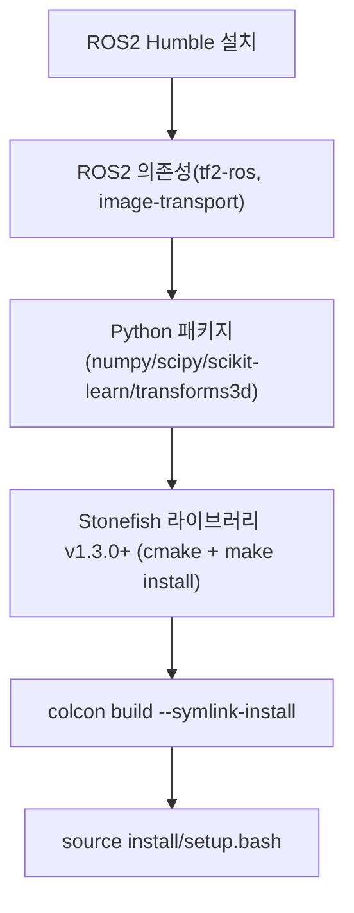
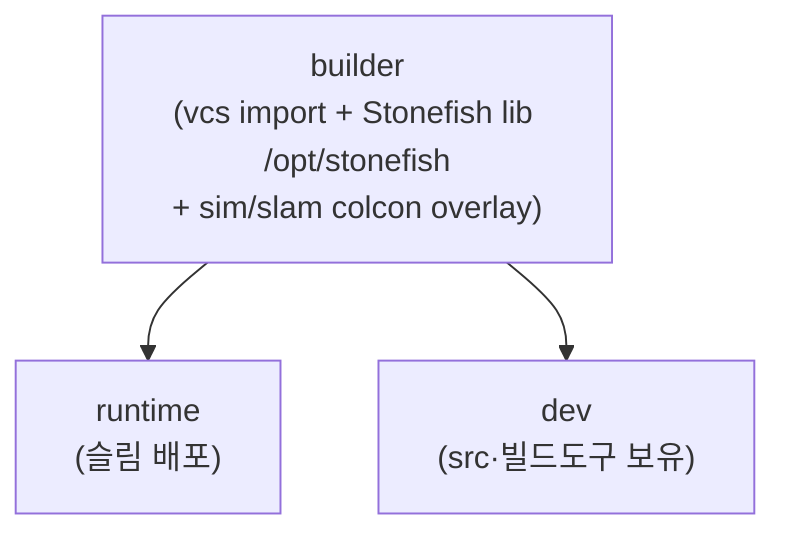

# 설치와 빌드

이 페이지는 `stonefish_sim`의 의존성 설치부터 `colcon` 빌드와 환경 source까지의 단계를 정리한다.

`stonefish_sim`은 ROS2 Humble 위에서 동작하는 7개 패키지 워크스페이스이며, C++ 시뮬레이터 래퍼(`stonefish_ros2`)가 별도 설치된 Stonefish 라이브러리에 의존한다. 따라서 빌드 전에 ROS2와 Python 의존성, 그리고 Stonefish 라이브러리를 먼저 설치해야 한다.

!!! tip "두 가지 설치 경로 — 네이티브 또는 Docker"
    설치는 두 방식 중 하나를 택한다. **호스트에 직접 설치**(아래 "단계별 설치")는 ROS2가 이미 깔린 개발 머신에서 코드를 자주 고칠 때 적합하다. **Docker 이미지 빌드**([Docker로 설치](#docker))는 의존성을 한 번에 재현 가능하게 묶어 **배포·재현**에 적합하다 — ROS2·Stonefish·sim·slam 빌드가 한 이미지 안에서 끝나므로 호스트에는 GPU 드라이버와 Docker만 있으면 된다. 처음 배포하거나 다른 머신에서 그대로 돌리려면 Docker 경로를 권장한다.

## 설치 흐름



## 의존성 목록

`README.md:5-44`에 정리된 빌드 의존성은 아래와 같다.

| 구분 | 항목 | 비고 |
|------|------|------|
| ROS2 | `ros-humble-desktop` | ROS2 Humble |
| ROS2 라이브러리 | `tf2-ros` | TF 변환 |
| ROS2 라이브러리 | `image-transport` | 카메라/소나 이미지 전송 |
| Python | `numpy` | 의사역(thruster allocation) 등 수치 연산 |
| Python | `scipy` | 보간·수치 계산 |
| Python | `scikit-learn` | |
| Python | `transforms3d` | 쿼터니언/좌표 변환 |
| 외부 C++ | Stonefish 라이브러리 v1.3.0+ | `HERO-Lab-POSTECH/stonefish`, `cmake` + `make install` |

!!! note "Stonefish 라이브러리는 ROS2 패키지가 아니다"
    Stonefish 라이브러리(`HERO-Lab-POSTECH/stonefish`)는 colcon 워크스페이스 바깥에서 `cmake` + `make install`로 시스템에 먼저 설치하는 별도 C++ 라이브러리다. `stonefish_ros2` 패키지가 이 라이브러리를 래핑하여 센서/액추에이터 게이트웨이로 사용한다.

## 단계별 설치

### 1. ROS2 Humble 설치

ROS2 Humble 데스크톱 구성을 설치한다.

```bash
sudo apt install ros-humble-desktop
```

### 2. ROS2 의존성 설치

`tf2-ros`와 `image-transport`를 설치한다.

```bash
sudo apt install ros-humble-tf2-ros ros-humble-image-transport
```

### 3. Python 패키지 설치

`stonefish_control`, `stonefish_thruster_manager`, `stonefish_trajectory_manager`(모두 `ament_python` 빌드타입)가 사용하는 Python 의존성을 설치한다.

```bash
pip install numpy scipy scikit-learn transforms3d
```

### 4. Stonefish 라이브러리(v1.3.0+) 설치

`HERO-Lab-POSTECH/stonefish` 라이브러리를 v1.3.0 이상으로 받아 `cmake` + `make install`로 설치한다.

```bash
git clone https://github.com/HERO-Lab-POSTECH/stonefish.git
cd stonefish
mkdir build && cd build
cmake ..
make -j$(nproc)
sudo make install
```

!!! warning "버전 요구사항"
    Stonefish 라이브러리는 v1.3.0 이상이어야 한다(`README.md:5-44`). 더 낮은 버전에서는 `stonefish_ros2`의 시뮬레이터 래퍼가 기대하는 인터페이스와 맞지 않을 수 있다.

### 5. colcon 빌드

워크스페이스 루트(7개 패키지를 포함하는 디렉토리)에서 `colcon build`를 실행한다. `--symlink-install`을 사용하면 Python 노드와 설정 파일을 재빌드 없이 수정 반영할 수 있다.

```bash
colcon build --symlink-install
```

### 6. 환경 source

빌드 산출물(`install/`)을 현재 셸에 등록한다.

```bash
source install/setup.bash
```

## Docker로 설치 {#docker}

위의 단계별 설치를 호스트에 직접 하는 대신, **Docker 이미지 하나로 ROS2·Stonefish 라이브러리·`stonefish_sim`·`stonefish_slam`을 모두 빌드**할 수 있다. 의존성이 이미지 안에 고정되므로 머신마다 환경을 맞출 필요가 없어 **배포·재현에 적합**하다.

소스는 `stonefish.repos`(vcstool)로 이미지 빌드 시점에 가져와 **이미지 안에 포함(baked)**된다 — 호스트 워크스페이스를 bind-mount하지 않으므로 받는 쪽은 Dockerfile만으로 자족적이다.

!!! note "환경 자산 위치 (SSOT)"
    Dockerfile·`docker-compose.yml`·`entrypoint.sh`·`stonefish.repos`·`.env.example`은 시뮬레이터 워크스페이스의 `.omp/env/`에 정본으로 관리된다. 한 이미지가 `stonefish`(C++ 코어)·`stonefish_sim`·`stonefish_slam` 세 repo를 함께 빌드하므로, sim과 slam의 Docker 설치 경로는 **동일한 `stonefish_bringup` 이미지**를 공유한다.

### 이미지 구조

멀티스테이지 빌드로 두 가지 leaf 타깃을 제공한다.

| 타깃 | 내용 | 용도 |
|------|------|------|
| `runtime` | `install/` 산출물만 COPY (빌드 도구·src 제외 = 슬림) | 배포 실행 |
| `dev` | builder 상속 — src·빌드 도구·`/workspace/src` 보유 | 컨테이너 안에서 코드 수정·`colcon` 재빌드 |



!!! note "워크스페이스 경로는 `/workspace`"
    컨테이너 안 colcon 워크스페이스 루트는 `/workspace`이고, Stonefish C++ 라이브러리는 `/opt/stonefish`에 설치된다(`CMAKE_PREFIX_PATH`로 overlay가 참조). overlay는 `--merge-install`로 빌드된다. 호스트 네이티브 설치와 경로가 다르므로 컨테이너 안에서 작업할 때는 `/workspace`를 기준으로 한다.

### 1. GPU·디스플레이 사전 준비

시뮬레이터는 **호스트의 X 디스플레이에 GLX로 직접 렌더**한다(Stonefish가 OpenGL 4.3+ GPU를 요구 — 공식 install 문서). 컨테이너 안에 별도 데스크톱이나 VirtualGL은 두지 않는다. 따라서 호스트에서 컨테이너의 X 접근을 먼저 허용한다.

```bash
xhost +local:
```

!!! warning "`:0` 세션이 활성이어야 한다"
    `DISPLAY=:0`에 직접 그리므로 호스트의 `:0` 세션이 **활성**(물리 로그인 또는 autologin)이어야 프레임버퍼가 검정이 아니다. 헤드리스 서버라면 GDM autologin 또는 dummy 모니터를 구성해야 한다. Chrome Remote Desktop 가상 디스플레이를 쓰는 머신은 `.env`의 `HOST_DISPLAY`를 `:20` 등으로 바꾼다.

### 2. `.env` 작성

`.omp/env/.env.example`을 `.env`로 복사해 머신별 값을 채운다. `.env`는 호스트 종속값(이미지 네임스페이스·태그·디스플레이·컨테이너 이름·빌드 타깃)을 담으며, Dockerfile·compose는 `${VAR}`만 참조한다(머신 종속값 하드코딩 없음).

```bash
cd .omp/env
cp .env.example .env
# 필요 시 편집: HOST_DISPLAY(:0/:20), BUILD_TARGET(runtime/dev), CONTAINER_NAME 등
```

| 변수 | 기본값 | 의미 |
|------|--------|------|
| `DOCKER_NAMESPACE` | `ghcr.io/hero-lab-postech` | 이미지 네임스페이스(로컬 태그용, push 안 함) |
| `IMAGE_TAG` | `latest` | 이미지 태그 |
| `CONTAINER_NAME` | `stonefish_run` | 컨테이너 이름(배포=`stonefish_run`, 개발=`stonefish_dev`) |
| `BUILD_TARGET` | `runtime` | 빌드 타깃(`runtime` 슬림 배포 / `dev` 코드작업) |
| `HOST_DISPLAY` | `:0` | 렌더할 호스트 X 디스플레이 |

### 3. 이미지 빌드

`.omp/env/`에서 compose로 이미지를 빌드한다. 배포본은 `runtime`, 컨테이너 안에서 코드를 고칠 거면 `.env`의 `BUILD_TARGET=dev`로 둔다.

```bash
docker compose build
```

### 4. 컨테이너 기동

```bash
docker compose up -d
```

기본 `command`는 `sleep infinity`라 컨테이너가 상주한다. 접속해 작업하거나 launch를 실행한다.

```bash
docker exec -it stonefish_run bash
# 컨테이너 안 — 환경은 entrypoint가 이미 source함
ros2 launch stonefish_ros2 bringup.launch.py vehicle:=bluerov2
```

배포 실행 시 `sleep infinity` 대신 launch를 바로 띄우려면 `.env`의 `CONTAINER_CMD`를 `ros2 launch ...`로 오버라이드한다.

!!! tip "dev 타깃으로 컨테이너 안에서 재빌드"
    `BUILD_TARGET=dev`로 빌드하면 `/workspace/src`에 소스가 남아 컨테이너 안에서 바로 수정·재빌드할 수 있다.
    ```bash
    docker exec -it stonefish_dev bash
    cd /workspace
    colcon build --merge-install
    source install/setup.bash
    ```

## 빌드 검증

source가 끝나면 노드를 launch하여 빌드를 확인할 수 있다. 가장 단순한 검증은 시뮬레이터만 기동하는 것이다(`README` 및 launch 정의 기준).

```bash
ros2 launch stonefish_ros2 bluerov2.launch.py
```

전체 스택(시뮬레이터 + 제어 + 경로 + thruster manager)을 한 번에 기동하려면 `bringup.launch.py`를 사용한다.

```bash
ros2 launch stonefish_ros2 bringup.launch.py vehicle:=bluerov2
```

!!! tip "새 터미널마다 source가 필요하다"
    `source install/setup.bash`는 현재 셸에만 적용된다. 새 터미널을 열 때마다 다시 source해야 `ros2 launch`로 패키지를 찾을 수 있다. `--symlink-install`로 빌드한 경우에도 Python 노드/설정 변경은 source된 환경에서 바로 반영되지만, 새 셸에서는 source 자체를 다시 해야 한다.

!!! warning "source를 빼먹으면 패키지를 찾지 못한다"
    빌드는 성공했는데 `ros2 launch`가 패키지를 찾지 못한다면, 대부분 `install/setup.bash`를 source하지 않았기 때문이다. 빌드 검증 전에 source가 선행되어야 한다.

## 테스트 실행

Python 노드의 단위 테스트는 `pytest`로 실행한다.

```bash
pytest -v
```

!!! note "테스트는 패키지를 직접 import하지 않는다"
    루트 `conftest.py`의 `load_module()` fixture는 모듈을 파일 경로로 직접 로드한다(`conftest.py:1-23`). 이는 ROS/gtsam 오염을 피하기 위한 것으로, 테스트가 패키지를 import하지 않고도 노드 로직을 검증할 수 있게 한다. 현재 기준 `pytest`는 42개 테스트를 통과한다(CHANGELOG v0.4.0).

## 다음 단계

설치가 끝나면 실행 launch와 RViz 시각화로 넘어갈 수 있다. 노드·토픽·파라미터의 상세는 각 방법론 페이지를 참고한다.
