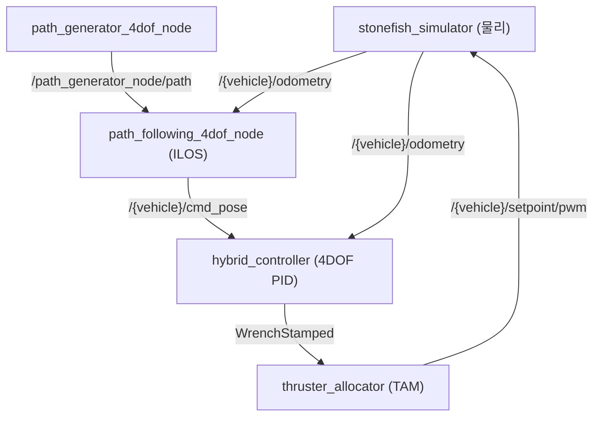
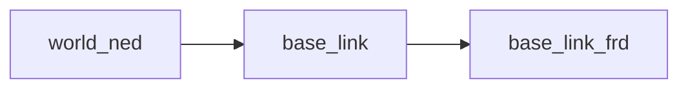

# 시뮬레이션 실행

이 페이지는 stonefish_sim을 4가지 시나리오(시뮬레이터만 / 제어만 / 전체통합 / 경로추종)로 실행하는 `ros2 launch` 커맨드와 주요 인자, RViz 시각화 설정, pytest 테스트 실행 방법을 다룬다.

!!! note "사전 준비"
    아래 명령은 모두 워크스페이스가 빌드되어 있고 환경이 source 된 상태를 전제로 한다. 빌드는 `colcon build --symlink-install` 후 `source install/setup.bash`로 수행한다(README.md:5-44). Stonefish 라이브러리 v1.3.0+가 설치되어 있어야 한다.

## 실행 시나리오 개요

stonefish_sim의 LIVE 노드는 패키지별 launch 파일로 기동된다. 어떤 launch가 어떤 노드를 띄우는지를 먼저 정리한다.

| 시나리오 | launch 커맨드 | 기동되는 LIVE 노드 |
|----------|---------------|--------------------|
| 시뮬레이터만 | `stonefish_ros2 bluerov2.launch.py` | `stonefish_simulator` (또는 `stonefish_simulator_nogpu`) |
| 제어만 | `stonefish_control control.launch.py` | `hybrid_controller` |
| 전체통합 | `stonefish_ros2 bringup.launch.py` | simulator + control + path + thruster_manager |
| 경로추종 | `stonefish_trajectory_manager path.launch.py` | `path_generator_4dof_node`, `path_following_4dof_node` |

근거: LIVE 노드 표(simulator.launch.py, control.launch.py, path.launch.py, thruster_manager.launch.py 기동), 5.2절 실행 launch.

LIVE 노드의 실행 경로는 다음과 같다.

| 노드명 | 패키지 | 실행 경로 |
|--------|--------|-----------|
| `stonefish_simulator` | stonefish_ros2 | `src/stonefish_simulator.cpp` (GPU) |
| `stonefish_simulator_nogpu` | stonefish_ros2 | `src/stonefish_simulator_nogpu.cpp` (CPU) |
| `hybrid_controller` | stonefish_control | `nodes/hybrid_controller_node.py:16` |
| `path_generator_4dof_node` | stonefish_trajectory_manager | `nodes/path_generator_node.py:40` |
| `path_following_4dof_node` | stonefish_trajectory_manager | `nodes/path_following_node.py:39` |
| `thruster_allocator` | stonefish_thruster_manager | `nodes/thruster_allocator_node.py:39` |

## 1. 시뮬레이터만 실행

Stonefish 물리 시뮬레이터 단독으로 차량과 환경, 센서를 띄운다. 제어기·경로추종 없이 시뮬레이터 출력 토픽(odometry, imu, dvl 등)만 확인하거나 수동으로 액추에이터 입력을 보낼 때 사용한다.

```bash
ros2 launch stonefish_ros2 bluerov2.launch.py
```

주요 인자는 다음과 같다.

| 인자 | 의미 |
|------|------|
| `vehicle_name` | 차량 이름(네임스페이스) |
| `scenario` | 로드할 시나리오 `.scn` |
| `window_res_x` / `window_res_y` | 렌더링 창 해상도 |
| `quality` | 렌더 품질. `low` / `medium` / `high`, `nogpu`로 CPU 시뮬레이터 선택 |
| `enable_base_link_frd` | `base_link_frd` 프레임 발행 여부 |

근거: 5.2절 실행 launch (params: vehicle_name, scenario, window_res_x/y, quality low/medium/high, enable_base_link_frd).

GPU가 없는 환경에서는 `quality:=nogpu`로 `stonefish_simulator_nogpu` 노드를 띄운다.

```bash
ros2 launch stonefish_ros2 bluerov2.launch.py quality:=nogpu
```

!!! note "시뮬레이터가 띄우는 것"
    `StonefishNode → ROS2SimulationManager(rate, scn, node) → ScenarioParser(.scn XML) → Robot / Terrain / Sensor`의 순으로 시나리오를 파싱한 뒤, `StepSimulation(dt=1/rate) → PublishSensorData → ReceiveActuatorInput → RenderFrame` 루프를 돈다. 강체동역학·유체항력·부력·센서 시뮬레이션이 여기서 수행된다(stonefish_simulator.cpp:1-120, ROS2Interface.h:59-85).

시뮬레이터가 발행하는 주요 출력 토픽은 다음과 같다.

| 토픽 | 타입 | 주기 | 설명 |
|------|------|------|------|
| `/{vehicle}/odometry` | `nav_msgs/Odometry` | 50Hz | NED 진실값(ground truth) |
| `/{vehicle}/imu` | `sensor_msgs/Imu` | 50Hz | 관성 측정 |
| `/{vehicle}/pressure` | `FluidPressure` | 10Hz | 압력(깊이) |
| `/{vehicle}/dvl` | `stonefish_msgs/DVL` | 10Hz | 도플러 속도계 |
| `/{vehicle}/fls/image` | 소나 이미지 | - | 전방 소나(FLS) |
| `/{vehicle}/camera_*/image_color` | 카메라 이미지 | - | 컬러 카메라 |

근거: 2.2절 주요 토픽 (ROS2Interface.h:64-81).

## 2. 제어만 실행

하이브리드 제어기 노드(`hybrid_controller`) 단독으로 띄운다. 별도로 동작 중인 시뮬레이터의 odometry 피드백을 받아 `cmd_pose` 목표를 추종하는 wrench를 산출한다.

```bash
ros2 launch stonefish_control control.launch.py vehicle_name:=bluerov2 use_sim_time:=false
```

| 인자 | 기본값 | 의미 |
|------|--------|------|
| `vehicle_name` | `bluerov2` | 차량 이름(네임스페이스) |
| `use_sim_time` | `false` | 시뮬레이션 시각(`/clock`) 사용 여부 |

근거: 5.2절 실행 launch (control.launch.py vehicle_name, use_sim_time).

하이브리드 제어기는 4DOF 선형 PID에 anti-windup back-calculation을 더한 구조이며, `velocity`/`position` 두 모드를 가진다. `/{vehicle}/control_mode` 토픽(`std_msgs/String`, `'velocity'` 또는 `'position'`)으로 모드를 즉시 절환하면 적분항이 리셋된다. 제어기의 입출력 토픽은 다음과 같다.

| 방향 | 토픽 | 타입 | 설명 |
|------|------|------|------|
| Subscribe | `/{vehicle}/odometry` | `nav_msgs/Odometry` | 상태 피드백 |
| Subscribe | `/{vehicle}/cmd_pose` | `TrajectoryPoint` | 목표 자세 |
| Subscribe | `/{vehicle}/control_mode` | `std_msgs/String` | 모드 전환 |
| Publish | `/{vehicle}/thruster_manager/input_stamped` | `WrenchStamped` | 6DOF wrench |

근거: 2.2절 토픽, 4.3절 Hybrid Controller.

제어 게인은 `hybrid_controller.yaml`에서 로드된다. 주요 파라미터는 [제어기 방법론](../methodology/control.md) 또는 파라미터 레퍼런스를 참조하라. 핵심 모드별 차이만 요약하면 다음과 같다.

| 파라미터 | velocity 모드 | position 모드 |
|----------|---------------|---------------|
| `Kp` | `[200,200,250,150]` | `[300,300,400,200]` |
| `Ki` | `[50,50,60,10]` | `[10,10,20,5]` |
| `max_force` | `800.0` | `200.0` |
| `max_torque` | `160.0` | `50.0` |
| `integral_safety_factor` | `0.5` | `2.0` |

근거: hybrid_controller_node.py:51-88 / hybrid_controller.yaml.

!!! tip "어떤 모드를 쓸까"
    `velocity` 모드는 경로추종에 적합하다(높은 `Kp`로 빠르고 반응적). `position` 모드는 위치유지(station-keeping)에 적합하다(낮은 `Ki`와 보수적 포화한계로 정밀하고 안정적). 모드 전환은 `/{vehicle}/control_mode` 토픽 한 번으로 즉시 적용된다.

## 3. 전체통합 실행

시뮬레이터 + 제어 + 경로 + 추력 배분을 한 번에 띄운다. 가장 일반적인 end-to-end 실행 경로다.

```bash
ros2 launch stonefish_ros2 bringup.launch.py vehicle_name:=bluerov2 scenario:=bluerov2_infrastructure
```

| 인자 | 기본값 | 의미 |
|------|--------|------|
| `vehicle_name` | `bluerov2` | 차량 이름(네임스페이스) |
| `scenario` | `bluerov2_infrastructure` | 로드할 시나리오 |

근거: 5.2절 실행 launch (bringup.launch.py 내부: simulator+control+path+thruster_manager).

전체통합 시 데이터가 흐르는 경로를 표현하면 다음과 같다.



근거: 2.2절 토픽 흐름, 4.1절 ILOS, 4.3절 제어기, 4.4절 thruster manager.

이 구성에서 `thruster_allocator`는 6DOF wrench를 의사역(pseudo-inverse) 추력배분행렬 TAM으로 풀어 8개 추진기 명령(`F1`-`F8`)을 만든 뒤 PWM으로 정규화하여 `/{vehicle}/setpoint/pwm`(`Float64MultiArray`)로 발행한다(4.4절). 8추진기 → 6DOF의 과작동(redundant) 시스템이므로 최소노름 해를 사용한다.

## 4. 경로추종 실행

경로 생성과 경로추종 노드를 띄운다. RViz 시각화도 이 launch와 함께 구성된다(5.5절).

```bash
ros2 launch stonefish_trajectory_manager path.launch.py vehicle_name:=bluerov2 use_sim_time:=true
```

| 인자 | 기본값 | 의미 |
|------|--------|------|
| `vehicle_name` | `bluerov2` | 차량 이름(네임스페이스) |
| `use_sim_time` | `true` | 시뮬레이션 시각(`/clock`) 사용 여부 |

근거: 5.2절 실행 launch (path.launch.py vehicle_name, use_sim_time).

이 launch는 두 LIVE 노드를 띄운다.

- `path_generator_4dof_node`(path_generator_node.py:40): waypoint 집합을 보간하여 `/path_generator_node/path`(`nav_msgs/Path`)를 발행한다. 보간 방식은 Cubic Spline(C2 연속), LIPB(Monotone Cubic Hermite, 오버슈팅 없음), Linear 3종이다(4.2절).
- `path_following_4dof_node`(path_following_node.py:39): 경로를 ILOS guidance로 추종하여 50Hz로 `/{vehicle}/cmd_pose`(`TrajectoryPoint`)를 발행한다(path_following_node.py:150).

ILOS guidance는 Lekkas & Fossen(2014)에 기반하며 원하는 코스각을 다음과 같이 계산한다.

\[
\chi_d = \chi_{\text{path}} + \arctan\!\left(\frac{-e_y}{\Delta}\right) - \arctan\!\left(\frac{\kappa_{\text{ILOS}} \int e_y\, dt}{\Delta}\right)
\]

여기서 \( e_y \)는 횡오차(cross-track error), \( \Delta \)는 전방주시거리(`lookahead_distance`)다(4.1절, ilos_guidance.py).

경로추종의 핵심 파라미터(`path_following.yaml`)는 다음과 같다.

| 파라미터 | 기본값 | 의미 |
|----------|--------|------|
| `lookahead_distance` | `3.0` | 전방주시거리 m (LOS) |
| `cruise_speed` | `0.5` | 직선 주행속도 m/s (~1knot) |
| `min_speed` | `0.2` | 커브 최소속도 m/s |
| `curvature_gain` | `2.0` | 곡률 기반 속도저감 계수 |
| `integral_gain` | `0.05` | ILOS 적분게인 κ |
| `use_alos` | `False` | `True`면 ALOS, `False`면 ILOS |
| `adaptive_lookahead` | `True` | 곡률 기반 동적 전방주시 |

근거: path_following_node.py:46-72 / path_following.yaml.

!!! tip "경로추종 튜닝 직관"
    `lookahead_distance`가 클수록 수렴이 부드럽고 느려진다. `curvature_gain`이 클수록 커브에서 더 많이 감속한다. `integral_gain`은 누적 횡오차를 보정한다. 직선 목표속도는 `cruise_speed`로 정한다. `use_alos:=false`(ILOS)가 권장 설정이다.

## RViz 시각화

경로추종 launch는 `trajectory.rviz` 설정과 함께 RViz를 띄운다(5.5절). RViz에는 경로, 현재위치, 목표자세, 그리고 TF 트리가 표시된다.

```bash
ros2 launch stonefish_trajectory_manager path.launch.py vehicle_name:=bluerov2
```

표시되는 주요 항목은 다음과 같다.

| 표시 항목 | 출처 토픽/프레임 |
|-----------|------------------|
| 생성된 경로 | `/path_generator_node/path` (`nav_msgs/Path`) |
| 현재 위치 | `/{vehicle}/odometry` |
| 목표 자세 | `/{vehicle}/cmd_pose` (`TrajectoryPoint`) |
| TF 트리 | `base_link`, `world_ned`, `base_link_frd` |

근거: 5.5절 RViz (path.launch.py + trajectory.rviz, 경로/현재위치/목표자세/TF트리).

TF 트리의 프레임 관계는 다음과 같다.



근거: 5.5절 TF트리(base_link, world_ned, base_link_frd), CONVENTIONS 좌표계 NED(REP103 `_ned`).

!!! note "좌표계 규약"
    이 시뮬레이터는 NED(North-East-Down) 좌표계를 사용한다(REP-103의 `_ned` 접미사 규약). 쿼터니언은 내부적으로 `[w, x, y, z]` 순서로 다루며 ROS 표준 `[x, y, z, w]`와 변환된다(CONVENTIONS). `base_link_frd`(Forward-Right-Down) 프레임은 시뮬레이터 launch의 `enable_base_link_frd` 인자로 발행 여부를 제어한다.

## 테스트 실행

워크스페이스 루트에서 pytest로 단위 테스트를 실행한다.

```bash
pytest -v
```

테스트는 루트 `conftest.py`의 `load_module()` fixture를 사용한다. 이 fixture는 패키지 전체를 import하지 않고 개별 모듈을 직접 로드하여, ROS/gtsam 등으로 오염된 패키지 import를 회피한다(conftest.py:1-23).

!!! warning "패키지 import 금지"
    `conftest.py`의 `load_module()` fixture는 테스트 대상 모듈을 패키지 import 경로가 아니라 파일 단위로 로드하도록 설계되어 있다(conftest.py:1-23). 테스트 코드에서 패키지를 통째로 import하면 ROS/gtsam 런타임 의존성에 의해 import가 실패할 수 있으므로, 모듈 로드는 이 fixture를 거쳐야 한다.

v0.4.0 기준 테스트 현황은 다음과 같다.

| 항목 | 결과 |
|------|------|
| pytest | 42 passed (이전 대비 +6) |
| C++ | 정적검증만 수행 |

근거: CHANGELOG v0.4.0 Verification (pytest 42 passed, C++ 정적검증만).

## 설정 파일 위치

각 실행 시나리오가 로드하는 설정 파일은 다음과 같다.

| 설정 | 파일 |
|------|------|
| 제어 게인 | `hybrid_controller.yaml` |
| 동역학 파라미터 | `dynamics_params.yaml` |
| 추력 배분 | `TAM.yaml` |
| 경로추종 | `path_following.yaml` |
| 경로생성 | `path_generator.yaml` |
| 시나리오 | `*.scn` |

근거: 5.4절 설정 파일 위치.
