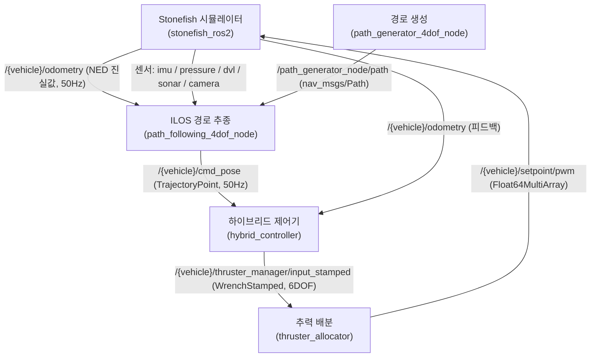

# stonefish_sim

ROS2 Humble 위에서 Stonefish 물리엔진으로 수중 로봇을 시뮬레이션하고, 경로 생성·궤적 추종·하이브리드 제어·추력 배분 스택과 연결하는 통합 워크스페이스다. 이 페이지는 그 전체 그림을 한눈에 보여주고 나머지 문서로 들어가는 출입구 역할을 한다.

!!! note "버전"
    이 문서는 **stonefish_sim 0.4.0** 기준이다. 7개 ROS2 패키지 모두 버전 0.4.0, 라이선스 GPL-3.0으로 통일되어 있다.

## 무엇을 하는 워크스페이스인가

stonefish_sim은 BlueROV2/BlueBoat 같은 수중 로봇을 대상으로, 시뮬레이터가 만들어 낸 센서 출력을 받아 경로를 생성하고, ILOS 가이던스로 그 경로를 추종하고, 4DOF 하이브리드 PID 제어기가 힘·토크 명령을 만들고, 추력 배분으로 개별 추진기 명령으로 변환한 뒤, 다시 시뮬레이터에 입력하는 완결된 폐루프를 ROS2 노드들로 구성한다. C++ 시뮬레이터 래퍼(`stonefish_ros2`)와 Python 제어·궤적 스택(`stonefish_control`, `stonefish_trajectory_manager`, `stonefish_thruster_manager`)이 메시지 패키지를 매개로 연결된다.

## 7개 패키지 한 줄 요약

| 패키지 | 역할 | 빌드 타입 |
|--------|------|-----------|
| `stonefish_msgs` | DVL/INS/환경 제어 등 메시지·서비스 정의 | `ament_cmake` |
| `stonefish_control_msgs` | 궤적·경로 메시지 정의(`TrajectoryPoint`, `Waypoint`, `GuidanceCommand`) | `ament_cmake` |
| `stonefish_description` | 로봇 모델(BlueROV2/BlueBoat)·시나리오·환경 정의 | `ament_cmake` |
| `stonefish_ros2` | Stonefish C++ 시뮬레이터 래퍼(센서/액추에이터 게이트웨이) | `ament_cmake` |
| `stonefish_control` | PID 기반 4DOF 하이브리드 제어기(velocity/position 모드) | `ament_python` |
| `stonefish_thruster_manager` | TAM(Thruster Allocation Matrix) 기반 추력 배분 | `ament_python` |
| `stonefish_trajectory_manager` | ILOS/ALOS 경로 추종 + 궤적 생성 | `ament_python` |

근거: 각 패키지의 `package.xml` 전수 검토.

## 전체 데이터 흐름

시뮬레이터가 NED 진실값 odometry와 센서(IMU, 압력, DVL, 소나, 카메라)를 발행하면, 경로 생성기가 경유점으로부터 `nav_msgs/Path`를 만들고, ILOS 가이던스가 이 경로를 따라가는 목표 자세(`/{vehicle}/cmd_pose`)를 50Hz로 내보낸다. 하이브리드 제어기는 목표와 피드백 odometry의 오차로 6DOF wrench를 만들고, 추력 매니저가 이를 8개 추진기 PWM으로 배분해 시뮬레이터로 되돌린다.

근거: `ROS2Interface.h:64-81`, `hybrid_controller_node.py:45`, `path_following_node.py:150`.

## 이 문서를 읽는 법

문서는 네 축으로 나뉜다. 처음 접한다면 위에서 아래로, 특정 정보가 필요하다면 해당 섹션으로 바로 이동하면 된다.

| 축 | 무엇을 답하는가 | 들어가기 |
|----|----------------|----------|
| 시작하기 | 어떻게 설치·빌드하고 시뮬레이션을 실행하는가 | [시작하기 개요](getting-started/index.md) |
| 아키텍처 | 노드·토픽·메시지가 어떻게 연결되는가 | [시스템 구조](architecture/index.md) |
| 방법론·알고리즘 | ILOS·하이브리드 제어·궤적 생성·추력 배분이 어떤 원리로 동작하는가 | [방법론 개요](methodology/index.md) |
| 파라미터 레퍼런스 | 어떤 파라미터를 바꾸면 어떤 효과가 나는가 | [파라미터 개요](parameters/index.md) |

!!! tip "빠른 시작"
    전체 폐루프를 한 번에 띄우려면 `ros2 launch stonefish_ros2 bringup.launch.py vehicle_name:=bluerov2 scenario:=bluerov2_infrastructure`를 사용한다. 이 명령은 시뮬레이터·제어·경로·추력 매니저를 함께 기동한다. 설치 절차와 단계별 실행은 [시작하기](getting-started/index.md)를 참고하라.

!!! note "좌표계 규약"
    이 스택은 NED 좌표계(REP-103 `_ned` 접미사)를 기준으로 동작한다. 쿼터니언은 내부에서 `[w, x, y, z]`, ROS 인터페이스에서 `[x, y, z, w]` 순서를 쓴다. 자세한 규약은 [아키텍처](architecture/index.md)에서 다룬다.

## 버전·상태

현재 버전은 **0.4.0**이며, P4 단계에서 알고리즘·수치 정확성을 다뤘다. 버전별 변경 내역과 미해결 이슈(P4_FLAGS)는 [버전·상태](status.md) 페이지에 정리되어 있다.
