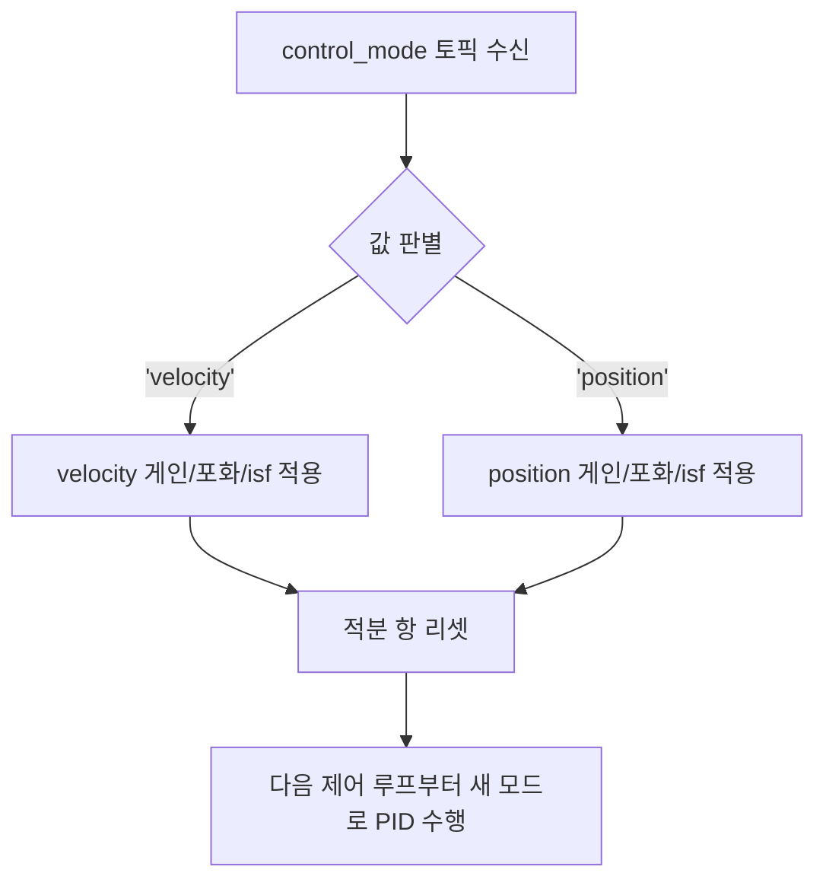

# 하이브리드 제어기

`stonefish_control` 패키지의 `hybrid_controller` 노드는 4DOF(surge, sway, heave, yaw) 선형 PID에 back-calculation anti-windup을 결합한 제어기로, `velocity` 모드와 `position` 모드를 `control_mode` 토픽으로 즉시 전환하며 동작한다.

## 제어 법칙

제어기는 4개 자유도(surge, sway, heave, yaw) 각각에 대해 다음 선형 PID 식으로 포화 적용 전 출력 \( u \)를 계산한다.

\[
u = K_p \cdot e + K_d \cdot (-v) + K_i \cdot \int e \, dt + M \cdot a_{ff}
\]

여기서 \( e \)는 오차, \( v \)는 바디 프레임 속도 \([u, v, w, r]\), \( \int e\,dt \)는 오차의 적분이다. D항은 오차의 미분 \( \dot{e} \)가 아니라 음의 바디 속도 \( -v \)를 쓴다(Fossen 2011 권장, position_controller.py:220-222). 마지막 \( M \cdot a_{ff} \) 항은 질량/관성 행렬 \( M = \mathrm{diag}([m, m, m, I_{zz}]) \)과 가속도 feedforward \( a_{ff} \)의 곱으로, `position` 모드에서만 그리고 `accel_ff`가 주어졌을 때만 더해진다(position_controller.py:240-245).

포화 한계 적용 후 출력은 \( u_{sat} = \mathrm{clip}(u, -\mathrm{sat}, +\mathrm{sat}) \)이며, 이 \( u_{sat} \)이 실제 \( \tau \)로 발행된다. back-calculation anti-windup은 \( \tau \) 식의 항이 아니라 적분기 상태를 직접 보정하는 별도 갱신으로, 출력이 포화됐을 때만 다음과 같이 동작한다(position_controller.py:256-274).

\[
\text{integral} \mathrel{-}= \frac{u - u_{sat}}{K_i} \cdot K_b
\]

여기서 \( u - u_{sat} \)은 포화로 잘려나간 초과 출력이고, 이를 역산 게인 \( K_b \)로 적분기에 되먹임해 적분 누적(windup)을 억제한다.

`velocity` 모드는 오차 \( e \)가 속도 오차, `position` 모드는 위치 오차로 정의되며, 두 모드 모두 위 동일한 제어 법칙을 공유하되 게인·포화 한계·적분 안전 인수가 다르다(hybrid_controller_node.py:51-88, hybrid_controller.yaml).

## velocity 모드 vs position 모드

두 모드는 같은 PID + anti-windup 구조를 쓰지만 추구하는 목적이 다르다. `velocity` 모드는 경로추종에 쓰이는 빠르고 반응적인 제어이고, `position` 모드는 위치 유지(station-keeping)를 위한 정밀하고 안정적인 제어다(hybrid_controller_node.py:51-88).

| 항목 | velocity 모드 | position 모드 |
|------|---------------|----------------|
| 목적 | 경로추종(빠름, 반응적) | 위치유지(정밀, 안정) |
| `Kp` (P게인) | `[200, 200, 250, 150]` | `[300, 300, 400, 200]` (높음 = 정밀) |
| `Kd` (D게인) | `[0.0, 100, 120, 80]` | `[150, 150, 200, 100]` |
| `Ki` (I게인) | `[50, 50, 60, 10]` | `[10, 10, 20, 5]` (낮음 = 안정) |
| `Kb` (역산 게인) | `[0.8, 0.8, 0.8, 0.8]` | `[0.8, 0.8, 0.8, 0.8]` |
| `max_force` (포화 한계) | `800.0` N | `200.0` N (보수적) |
| `max_torque` (포화 한계) | `160.0` Nm | `50.0` Nm (보수적) |
| `integral_safety_factor` | `0.5` | `2.0` (높음 = 큰 적분 허용) |

게인 벡터의 4개 성분은 `[surge, sway, heave, yaw]` 순서다. `position` 모드는 더 높은 P게인으로 정밀도를 확보하고, 더 낮은 I게인으로 안정성을 우선한다. 반대로 `velocity` 모드는 더 큰 포화 한계(`800` N / `160` Nm)로 빠른 응답을 낸다(hybrid_controller_node.py:55-68).

### 적분 한계와 안전 인수

적분 항의 누적 한계는 포화 한계와 게인, 그리고 `integral_safety_factor`로부터 결정된다.

\[
\text{적분 한계} = \frac{\text{포화 한계}}{K_i} \times \text{integral\_safety\_factor}
\]

`velocity` 모드의 `integral_safety_factor`는 `0.5`로 적분 누적을 보수적으로 제한하고, `position` 모드는 `2.0`으로 더 큰 적분 누적을 허용한다. `position` 모드에서 더 큰 적분을 허용하는 것은 정상상태(steady-state) 위치 오차를 끝까지 제거해 정밀한 위치 유지를 달성하기 위함이다(hybrid_controller_node.py:61, :68).

## 모드 전환 메커니즘

모드는 `/{vehicle}/control_mode` 토픽(`std_msgs/String`, 값 `'velocity'` 또는 `'position'`)으로 전환된다. 노드는 시작 시 `initial_mode`(기본값 `'velocity'`) 모드로 동작하며(hybrid_controller_node.py:54), 토픽 콜백이 모드를 받으면(`mode_callback`, hybrid_controller_node.py:89-95) `set_mode`를 호출해 실제로 모드가 바뀔 때만 새 모드 제어기의 적분 항을 리셋한다(hybrid_controller.py:55-66).

!!! note "모드 전환 시 적분 리셋"
    모드를 전환하면 적분 항이 리셋된다. 두 모드는 오차 정의(속도 오차 vs 위치 오차)와 게인·포화 한계가 다르므로, 이전 모드에서 누적된 적분값을 그대로 이어받으면 새 모드에서 windup을 유발할 수 있다. 즉시 절환 + 적분 리셋은 이 문제를 방지한다.

토픽으로 전환되는 모드 외에, 제어 루프 주기는 `control_rate`(기본값 `50.0` Hz)로, 대상 차량 네임스페이스는 `vehicle_name`(기본값 `'bluerov2'`)로 설정된다(hybrid_controller_node.py:52-53).

## P4에서 수정된 버그

CHANGELOG v0.4.0(P4, algorithmic/numeric correctness)에서 하이브리드 제어기와 직접 관련된 결함 두 건이 수정되었다(CHANGELOG v0.4.0, Fixed).

!!! warning "P4 수정: position 모드 feedforward 차원 오류 (T1.3)"
    `position` 모드의 feedforward 항에서 질량/관성 행렬 \( M \)과 가속도(accel)의 차원이 맞지 않던 버그가 수정되었다. 차원 불일치는 feedforward 보정량을 잘못 계산하게 만든다.

    다만 가속도 feedforward는 end-to-end로 완전히 연결되지는 않은 상태이며, `position` 모드의 feedforward 항은 현재 0으로 동작한다(P4_FLAGS #7, 미해결).

!!! warning "P4 수정: YAML wildcard 미로드 (T1.2)"
    하이브리드 제어기가 YAML 파라미터를 wildcard로 로드하지 못해 게인을 읽어오지 못하던 버그가 수정되었다. 이 결함은 `hybrid_controller.yaml`에 설정한 게인 값이 노드에 반영되지 않게 만든다.

!!! note "남은 게인 불일치 플래그 (P4_FLAGS #1)"
    `hybrid_controller.yaml`의 `position` 모드 `max_force`/`max_torque` 값과 코드 `declare_parameter` 기본값이 일치하지 않는 문제가 남아 있으나, 현재는 문서화만 된 상태다(P4_FLAGS #1). 위 표의 `200.0` N / `50.0` Nm은 코드 기본값이다.

## 게인 튜닝

각 모드의 게인(`Kp`, `Kd`, `Ki`, `Kb`)과 포화 한계(`max_force`, `max_torque`), 적분 안전 인수(`integral_safety_factor`)의 전체 목록과 기본값, 튜닝 가이드는 파라미터 레퍼런스 페이지를 참조하라.

- [제어 게인 파라미터 레퍼런스](../parameters/control-gains.md)
