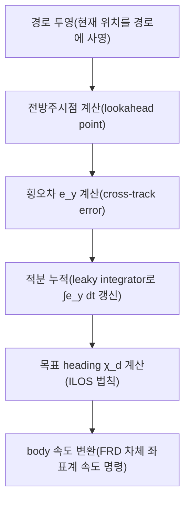

# ILOS 경로 추종

이 페이지는 `stonefish_trajectory_manager`의 ILOS(Integral Line-of-Sight) guidance가 경로를 어떻게 추종하는지 — 유도 수식, 계산 단계, 곡률 기반 속도 저감과 adaptive lookahead, ALOS와의 차이 — 를 다룬다. 구현은 `ilos_guidance.py`에 있고, `path_following_4dof_node`(`path_following_node.py:39`)가 이를 구동한다.

## 유도 법칙

ILOS guidance는 Lekkas & Fossen(2014)의 적분 LOS 법칙을 따른다. 목표 heading(course) \( \chi_d \)는 경로 접선 방향에 횡오차(cross-track error)를 줄이는 보정항과 정상상태 횡오차를 제거하는 적분 보정항을 더해 산출한다.

\[
\chi_d = \chi_{\text{path}} + \arctan\!\left(\frac{-e_y}{\Delta}\right) - \arctan\!\left(\frac{\kappa \int e_y\,dt}{\Delta}\right)
\]

각 항의 의미는 다음과 같다.

| 항 | 기호 | 의미 | 관련 파라미터 |
|----|------|------|---------------|
| 경로 접선 | \( \chi_{\text{path}} \) | 현재 경로 세그먼트의 진행 방향(접선 각도) | — |
| 횡오차 보정 | \( \arctan(-e_y/\Delta) \) | 횡오차 \( e_y \)를 경로 쪽으로 끌어당기는 비례 조향 | `lookahead_distance` \( \Delta \) |
| 적분 보정 | \( \arctan(\kappa \int e_y\,dt/\Delta) \) | 누적 횡오차를 제거해 정상상태 오프셋(예: 해류 외란)을 보상 | `integral_gain` \( \kappa \) |

여기서 \( e_y \)는 횡오차(cross-track error), \( \Delta \)는 전방주시거리(lookahead distance, `lookahead_distance`, 기본값 `3.0` m), \( \kappa \)는 ILOS 적분게인(`integral_gain`, 기본값 `0.05`)이다.

!!! note "전방주시거리 \( \Delta \)의 역할"
    \( \Delta \)가 클수록 횡오차 보정항의 각도가 작아져 조향이 부드러워지고 수렴이 느려진다. 작을수록 공격적으로 경로에 붙지만 진동 위험이 커진다. `adaptive_lookahead`(기본값 `True`)가 켜지면 곡률에 따라 \( \Delta \)를 동적으로 조정한다.

근거: 유도 수식과 단계는 `ilos_guidance.py`, 파라미터는 `path_following_node.py:46-47`.

## 계산 단계

`compute_guidance()`는 매 제어 주기(`update_rate`, 기본값 `50.0` Hz)마다 현재 odometry 피드백과 목표 경로로부터 다음 순서로 목표 자세·속도를 산출한다.

각 단계의 구현 위치는 다음과 같다.

| 단계 | 설명 | 구현 위치 |
|------|------|-----------|
| 경로 투영 | 현재 위치를 경로 세그먼트에 사영해 진행 위치를 찾음 | `ilos_guidance.py:374-434` |
| 전방주시점 | 사영점에서 \( \Delta \)만큼 앞선 lookahead point 산출 | `ilos_guidance.py:622-691` |
| 횡오차 | 경로 접선에 대한 수직 편차 \( e_y \) 계산 | `ilos_guidance.py:809-921` |
| 적분 누적(leaky) | \( \int e_y\,dt \)를 leaky integrator로 갱신(과누적 방지) | `ilos_guidance.py:263-319` |
| heading | ILOS 법칙으로 목표 course \( \chi_d \) 산출 | `ilos_guidance.py:693-762` |
| body 속도 변환 | \( \chi_d \)와 목표 속도를 FRD 차체 좌표계 속도로 변환 | `compute_guidance()` 내부 |

적분 누적은 leaky integrator로 구현되어 횡오차가 오래 누적되더라도 무한정 커지지 않으며, `integral_limit`(기본값 `5.0` m)로 상한이 걸린다.

!!! warning "적분게인 \( \kappa \) 조정 주의"
    `integral_gain` \( \kappa \)는 누적 횡오차를 보정하므로 해류 같은 정상상태 외란을 제거하는 데 핵심이다. 너무 크면 적분 보정항이 과도해져 진동·오버슈팅을 유발하고, 너무 작으면 정상상태 오프셋이 남는다. `integral_limit`을 함께 보면서 조정하라.

## 곡률 기반 속도 저감

직선 구간에서는 `cruise_speed`(기본값 `0.5` m/s, 약 1 knot)로 주행하고, 경로 곡률이 큰 커브에서는 속도를 줄여 추종 정밀도를 유지한다. 속도 저감의 강도는 `curvature_gain`(기본값 `2.0`)이 결정하며, 저감된 속도는 `min_speed`(기본값 `0.2` m/s) 아래로는 내려가지 않는다.

`curvature_gain`이 클수록 커브에서 더 강하게 감속한다. 곡률이 큰 경로(급격한 선회)일수록 차량이 경로 안쪽으로 잘라먹는 것을 방지하기 위해 속도를 낮춘다.

!!! tip "커브에서 경로를 벗어날 때"
    급커브에서 차량이 경로 바깥으로 벗어난다면 `curvature_gain`을 키워 커브 진입 속도를 더 낮추거나, `lookahead_distance`를 줄여 더 공격적으로 경로에 붙게 할 수 있다. 단 후자는 직선 구간 진동을 늘릴 수 있다.

## Adaptive lookahead

`adaptive_lookahead`(기본값 `True`)가 켜지면 전방주시거리 \( \Delta \)를 경로 곡률에 따라 동적으로 조정한다. 직선 구간에서는 \( \Delta \)를 키워 부드럽게 수렴하고, 곡률이 큰 구간에서는 \( \Delta \)를 줄여 경로를 더 정밀하게 따라간다. 고정 \( \Delta \)는 직선과 커브 모두에서 타협된 값을 써야 하지만, adaptive 모드는 구간별로 최적값에 가깝게 적응한다.

## ALOS vs ILOS

`use_alos`(기본값 `False`) 파라미터로 두 유도 법칙 중 하나를 선택한다. 기본값이 `False`이므로 ILOS가 권장 모드다.

| 항목 | ILOS (`use_alos: false`, 권장) | ALOS (`use_alos: true`) |
|------|-------------------------------|--------------------------|
| 적분 보정 | 누적 횡오차 \( \int e_y\,dt \)로 정상상태 오프셋 제거 | 적응 기반 LOS |
| 정상상태 외란 보상 | 적분항으로 해류 등 보상 | 구현체에 따름 |
| 구현 | `ilos_guidance.py` | `alos_guidance.py` |

두 구현은 모두 `stonefish_trajectory_manager`의 `path_following/` 아래에 있으며(`alos_guidance.py`, `ilos_guidance.py`), `path_following_node.py:69`의 `use_alos` 파라미터로 런타임에 선택된다.

## god-method 분해 (P4)

ILOS의 핵심 진입점인 `compute_guidance()`는 원래 단일 메서드 안에 319줄(`ilos_guidance.py:632-951`)에 걸쳐 경로 기하·heading·속도·차체 변환이 한데 뭉쳐 있던 god-method였다. P4(algorithmic/numeric correctness) 작업에서 이를 다음 4개 헬퍼로 분해해 단계별 책임을 분리했다.

| 헬퍼 | 책임 |
|------|------|
| `_compute_lookahead_geometry` | 경로 투영·전방주시점·횡오차 등 기하 계산 |
| `_compute_heading_command` | ILOS 법칙으로 목표 heading \( \chi_d \) 산출 |
| `_compute_desired_speed` | 곡률 기반 속도 저감을 반영한 목표 속도 |
| `_compute_body_velocities` | FRD 차체 좌표계 속도 명령으로 변환 |

근거: 헬퍼는 `ilos_guidance.py`에 구현되어 있고, 분해 대상이던 원본 god-method(319줄, L632-951)는 `P4_FLAGS.md`에 기록되어 있다.

## 파라미터

ILOS guidance의 전체 파라미터(`lookahead_distance`, `integral_gain`, `lateral_gain`, `cruise_speed`, `min_speed`, `curvature_gain`, `use_alos`, `adaptive_lookahead` 등)와 기본값·YAML 매핑은 [경로 추종 파라미터](../parameters/path-following.md)를 참조하라.
