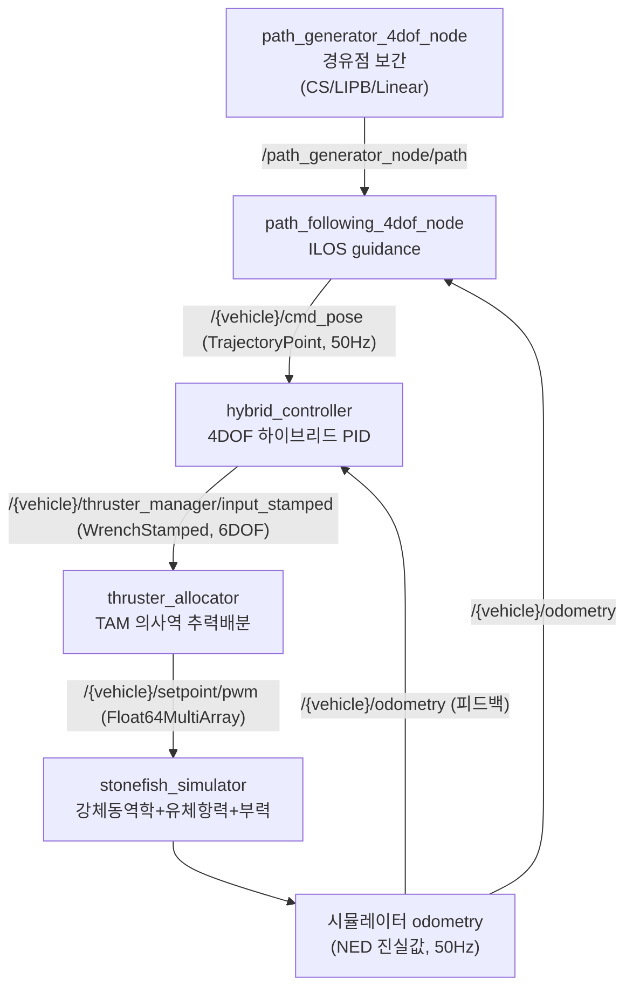

# 방법론 개요

이 페이지는 stonefish_sim의 제어·궤적 스택 전체 알고리즘 그림을 제어 루프 한 바퀴(경로생성 → ILOS guidance → 하이브리드 PID → 추력배분 → 시뮬레이터 물리) 흐름으로 요약하고, 각 알고리즘의 상세 페이지로 안내한다.

## 제어 루프 한 바퀴

제어 스택은 네 개의 LIVE 노드와 시뮬레이터가 토픽으로 연결되어 한 주기를 구성한다. 경로 생성기가 경유점을 보간해 경로를 만들고, ILOS guidance가 경로를 추종하는 목표 자세(`cmd_pose`)를 내며, 하이브리드 PID 제어기가 6DOF wrench를 산출하고, 추력 관리자가 이를 8개 추진기 입력으로 배분하면, Stonefish 시뮬레이터가 물리 적분을 수행해 다시 odometry 피드백을 돌려준다.

근거: 노드·토픽 연결은 `hybrid_controller_node.py:45`, `path_following_node.py:150`, `ROS2Interface.h:64-81`. 추력 배분 출력 토픽은 분석 사실 §4.4.

## 데이터 흐름 요약

| 단계 | 노드 | 입력 | 출력 |
|------|------|------|------|
| 경로 생성 | `path_generator_4dof_node` | 경유점(`Waypoint`) | `/path_generator_node/path` (`nav_msgs/Path`) |
| 경로 추종 | `path_following_4dof_node` | `path`, `/{vehicle}/odometry` | `/{vehicle}/cmd_pose` (`TrajectoryPoint`, 50Hz) |
| 제어 | `hybrid_controller` | `cmd_pose`, `odometry`, `/{vehicle}/control_mode` | `/{vehicle}/thruster_manager/input_stamped` (`WrenchStamped`, 6DOF) |
| 추력 배분 | `thruster_allocator` | 6DOF wrench | `/{vehicle}/setpoint/pwm` (`Float64MultiArray`) |
| 물리 | `stonefish_simulator` | 추진기 입력 | `/{vehicle}/odometry`, `/{vehicle}/imu`, `/{vehicle}/dvl` 등 |

근거: 분석 사실 §2.2, §2.1.

## 알고리즘별 한 줄 요약

각 알고리즘의 수식·파라미터·튜닝 효과는 아래 상세 페이지에서 다룬다.

**하이브리드 제어** — 4DOF 선형 PID에 back-calculation anti-windup을 더한 제어기. `τ = Kp·e + Kd·ė + Ki·∫e - Kb·(sat-unsat)`. `velocity` 모드(빠른 반응, `max_force` 800N)와 `position` 모드(정밀 유지, `max_force` 200N)를 `control_mode` 토픽으로 즉시 절환하며 절환 시 적분을 리셋한다(`hybrid_controller_node.py:51-88`). 상세: [하이브리드 제어기](control.md).

**ILOS guidance** — Lekkas & Fossen(2014)의 적분 LOS 경로추종. 목표 침로 `χ_d = χ_path + arctan(-e_y/Δ) - arctan(κ_ILOS·∫e_y dt/Δ)`로 정상 횡오차를 leaky 적분으로 보정한다(`ilos_guidance.py:1-1068`). 상세: [ILOS 경로 추종](guidance.md).

**보간(Path Generator)** — 경유점을 Cubic Spline(C2 연속), LIPB(Monotone Cubic Hermite, 오버슈팅 없음), Linear 세 방식으로 보간해 경로를 생성한다(분석 사실 §4.2). 상세: [궤적 생성과 추력 배분](trajectory-thruster.md).

**추력 배분(Thruster Manager)** — TAM(Thruster Allocation Matrix)의 의사역으로 6DOF wrench를 8개 추진기 힘으로 분배하는 최소노름 해. `F = TAM_pinv · Wrench` 후 PWM 정규화(`max_thrust` 200)한다(분석 사실 §4.4). 상세: [궤적 생성과 추력 배분](trajectory-thruster.md).

**Stonefish 물리** — `StepSimulation(dt=1/rate)`마다 강체동역학·유체항력·부력·센서 시뮬레이션을 수행하고 센서 데이터를 publish, 액추에이터 입력을 receive하는 C++ 시뮬레이션 루프(`stonefish_simulator.cpp:1-120`, `ROS2Interface.h:59-85`).

## 두 제어 모드

하이브리드 제어기는 같은 PID 구조를 두 게인 세트로 운용한다. `velocity` 모드는 경로추종에, `position` 모드는 위치 유지에 쓰인다.

| 항목 | `velocity` 모드 | `position` 모드 |
|------|-----------------|------------------|
| 용도 | 경로추종(빠름, 반응적) | 위치유지(정밀, 안정) |
| `Kp` | `[200,200,250,150]` | `[300,300,400,200]` |
| `Ki` | `[50,50,60,10]` | `[10,10,20,5]` |
| `max_force` | `800.0` N | `200.0` N |
| `max_torque` | `160.0` Nm | `50.0` Nm |
| `integral_safety_factor` | `0.5` | `2.0` |

근거: `hybrid_controller_node.py:55-68`.

!!! note "모드 절환"
    `/{vehicle}/control_mode` 토픽(`std_msgs/String`, `'velocity'`/`'position'`)으로 즉시 절환하며, 절환 시 적분 항을 리셋한다(분석 사실 §4.3).

!!! warning "YAML과 코드 기본값 불일치"
    `hybrid_controller.yaml`과 코드의 `max_force`·`max_torque` 기본값 일부가 일치하지 않는 P4_FLAGS 미해결 이슈가 있으며, 현재는 문서화만 된 상태다. 게인이나 한계값을 바꿀 때는 두 위치를 함께 확인할 것(분석 사실 §3.1, §6 P4_FLAGS).

## 좌표계 규약

스택 전체는 NED(REP103 `_ned`) 좌표계를 사용한다. 쿼터니언은 내부적으로 `[w,x,y,z]` 순서를 쓰고 ROS 메시지의 `[x,y,z,w]`와 변환된다. 시뮬레이터 `odometry`는 NED 진실값을 50Hz로 publish한다(분석 사실 §CONVENTIONS, §2.2).
