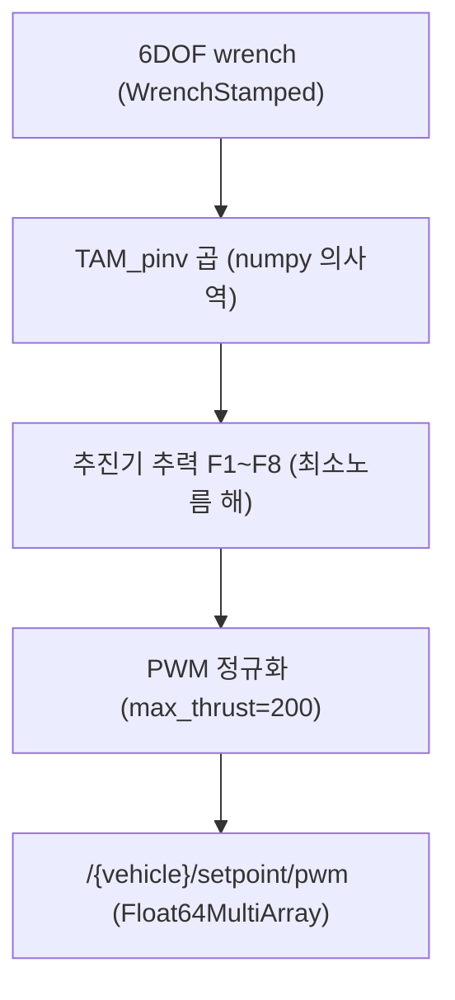

# 궤적 생성과 추력 배분

이 페이지는 `stonefish_trajectory_manager`의 경로 보간 3종(Cubic Spline / LIPB / Linear)과 `stonefish_thruster_manager`의 의사역 기반 6DOF wrench→8추진기 추력 배분을 다룬다.

## 궤적 생성: 보간 3종

`path_generator_node`(`path_generator_node.py:40`의 `path_generator_4dof_node`)는 경유점(Waypoint) 집합을 매끄러운 경로로 변환한다. 보간기는 `path_generator/` 아래에 `cs`(Cubic Spline), `lipb`, `linear` 세 가지로 구현되어 있다.

| 보간 방식 | 구현 파일 | 연속성·특성 | 오버슈팅 |
|-----------|-----------|-------------|----------|
| Cubic Spline | `cs_interpolator.py` | C2 연속(2계 도함수까지 연속) | 발생 가능 |
| LIPB | `lipb_interpolator.py` | Monotone Cubic Hermite(단조 보존) | 없음 |
| Linear | `linear_interpolator.py` | 구간 선형(C0) | 없음 |

근거: `path_generator/{cs,lipb,linear}_interpolator.py` (분석 사실 §1.2, §4.2).

세 보간의 트레이드오프는 매끄러움과 형상 보존 사이의 선택이다. Cubic Spline은 C2 연속으로 가장 부드럽지만 경유점 사이에서 경로가 부풀어 오르는 오버슈팅이 생길 수 있다. LIPB는 Monotone Cubic Hermite 보간으로 단조성을 보존하여 오버슈팅이 없고, Linear는 구간 선형이라 형상은 정확하나 변곡점에서 꺾인다.

### LIPB god-method 분해 (P4)

LIPB 보간기의 `init_interpolator`는 P4 이전 152줄짜리 단일 메서드(god-method)였으며, P4에서 6개의 헬퍼로 분해되었다. 근거: 분석 사실 §4.2.

!!! note "P4 리팩터링 맥락"
    LIPB의 `init_interpolator`(152줄) 분해는 ILOS guidance의 `compute_guidance`(319줄→4 헬퍼) 분해와 같은 P4 algorithmic correctness 작업의 일부다. ILOS 쪽 분해와 경로추종 파라미터는 [경로 추종(ILOS)](../parameters/path-following.md)을 참조하라.

## 추력 배분: TAM 의사역

`thruster_allocator`(`thruster_allocator_node.py:39`)는 제어기가 산출한 6DOF wrench를 8개 추진기 추력으로 변환한다. 핵심 식은 추력 배분 행렬(TAM, Thruster Allocation Matrix)의 의사역(pseudo-inverse)을 쓰는 최소노름 해다.

\[
F = \mathrm{TAM}^{+} \cdot \tau
\]

여기서 \(\tau\)는 6DOF wrench(Surge/Sway/Heave/Roll/Pitch/Yaw), \(F = [F_1, \dots, F_8]\)은 8개 추진기 추력, \(\mathrm{TAM}^{+}\)는 numpy로 계산한 TAM의 의사역이다. 근거: 분석 사실 §4.4.

### 배분 파이프라인

입력 토픽은 `/{vehicle}/thruster_manager/input_stamped`(`WrenchStamped`, 6DOF)이고, 출력은 `/{vehicle}/setpoint/pwm`(`Float64MultiArray`)이다. 근거: 분석 사실 §2.2, §4.4.

### 과작동(redundancy)과 최소노름 해

추진기는 8개인데 제어 자유도는 6DOF이므로 시스템은 과작동(over-actuated, redundant)이다. 즉 같은 wrench를 만드는 추력 조합이 무수히 많으며, 의사역은 이 중 노름(에너지)이 최소인 해를 선택한다. 근거: 분석 사실 §3.5, §4.4.

### TAM 6×8 행렬 구조

TAM은 6행(Surge/Sway/Heave/Roll/Pitch/Yaw) × 8열(추진기 T1~T8)의 행렬로, `TAM.yaml`에 정의된다. 추진기 배치는 수평 4개와 수직 4개로 나뉜다.

| 추진기 그룹 | 추진기 | 배치 |
|-------------|--------|------|
| 수평 | T1~T4 | 45° 벡터드 |
| 수직 | T5~T8 | 수직 |

근거: `TAM.yaml:1-52` (분석 사실 §3.5).

### PWM 정규화

추진기 추력은 `max_thrust` 척도로 PWM 정규화된다. 기본값은 `200.0`이다.

| 파라미터 | 기본값 | 의미 |
|----------|--------|------|
| `tam_file` | `''` | TAM 정의 파일 경로 |
| `vehicle_name` | `'bluerov2'` | 차량 이름(네임스페이스) |
| `base_link` | `'base_link'` | 기준 프레임 |
| `update_rate` | `50.0` | 갱신 Hz |
| `timeout` | `1.0` | 입력 타임아웃 s |
| `max_thrust` | `200.0` | PWM 정규화 척도 |

근거: `thruster_allocator_node.py:41-59` (분석 사실 §3.3).

!!! warning "max_thrust는 물리 한계가 아니다"
    `max_thrust`(`200.0`)는 PWM 정규화에 쓰이는 척도이며 추진기의 물리적 추력 한계가 아니다. 이 값을 바꾸면 같은 wrench에 대한 PWM 출력 스케일이 함께 바뀐다. 근거: 분석 사실 §3.3.

## 관련 파라미터

추진기 배치, TAM 행렬 세부, 차량 동역학(질량·관성·부력 등) 파라미터는 [동역학·추력 배분](../parameters/dynamics-tam.md)에 정리되어 있다. 제어기가 산출하는 wrench의 생성 방식은 [하이브리드 제어기](control.md)를 참조하라.
