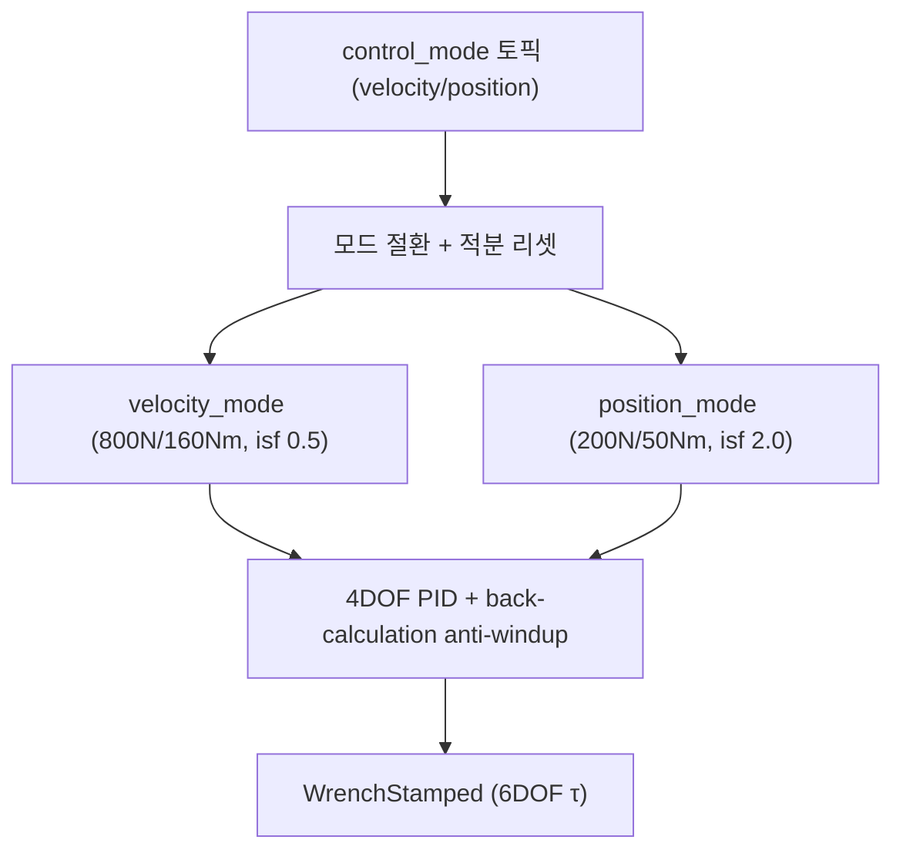

# 제어 게인 파라미터

이 페이지는 `hybrid_controller` 노드가 사용하는 모든 제어 파라미터(`velocity_mode`/`position_mode`의 PID·anti-windup 게인 및 포화 한계)를 `hybrid_controller_node.py:51-88`과 `hybrid_controller.yaml` 기준으로 빠짐없이 정리하고, 각 게인을 올리거나 내릴 때의 효과를 설명한다.

## 개요

`hybrid_controller`는 4DOF(surge, sway, heave, yaw) 선형 PID 제어기로, anti-windup 역산(back-calculation)을 포함한다. 제어 법칙은 다음과 같다.

\[
\tau = K_p \cdot e + K_d \cdot \dot{e} + K_i \cdot \int e\, dt - K_b \cdot (\text{sat} - \text{unsat})
\]

여기서 마지막 항이 역산 anti-windup 보정으로, 포화된 출력(`sat`)과 포화 전 출력(`unsat`)의 차이를 적분기로 되먹임한다(근거: `hybrid_controller_node.py:51-88`).

이 제어기는 두 가지 모드를 가지며 `control_mode` 토픽(`std_msgs/String`, `'velocity'`/`'position'`)으로 즉시 절환된다. 모드 전환 시 적분기는 리셋된다. `velocity` 모드는 경로추종용으로 빠르고 반응적이며, `position` 모드는 위치유지용으로 정밀하고 안정적이다(근거: `hybrid_controller_node.py`, 분석 사실 4.3).

## 공통 파라미터

모드와 무관한 노드 단위 파라미터다.

| 파라미터 | 기본값 | 타입 | 정의 위치 | YAML 위치 | 의미 |
|---|---|---|---|---|---|
| `vehicle_name` | `'bluerov2'` | str | `hybrid_controller_node.py:52` | `hybrid_controller.yaml:19` | 차량 이름(네임스페이스) |
| `control_rate` | `50.0` | float | `hybrid_controller_node.py:53` | `hybrid_controller.yaml:20` | 제어 루프 주파수(Hz) |
| `initial_mode` | `'velocity'` | str | `hybrid_controller_node.py:54` | `hybrid_controller.yaml:21` | 노드 시작 시 진입 모드 |

## velocity_mode 게인

경로추종(빠르고 반응적)에 사용되는 모드다. 모든 게인 리스트의 인덱스는 `[surge, sway, heave, yaw]` 순서를 따른다.

| 파라미터 | 기본값 | 타입 | 정의 위치 | YAML 위치 | 의미 |
|---|---|---|---|---|---|
| `velocity_mode.Kp` | `[200, 200, 250, 150]` | list | `hybrid_controller_node.py:55` | `hybrid_controller.yaml:30` | 속도 P게인 `[surge, sway, heave, yaw]` |
| `velocity_mode.Kd` | `[0.0, 100, 120, 80]` | list | `hybrid_controller_node.py:56` | `hybrid_controller.yaml:31` | 속도 D게인 |
| `velocity_mode.Ki` | `[50, 50, 60, 10]` | list | `hybrid_controller_node.py:57` | `hybrid_controller.yaml:32` | 속도 I게인 |
| `velocity_mode.Kb` | `[0.8, 0.8, 0.8, 0.8]` | list | `hybrid_controller_node.py:58` | `hybrid_controller.yaml:33` | 역산 게인(anti-windup) |
| `velocity_mode.max_force` | `800.0` | float | `hybrid_controller_node.py:59` | `hybrid_controller.yaml:36` | 최대 힘(N) |
| `velocity_mode.max_torque` | `160.0` | float | `hybrid_controller_node.py:60` | `hybrid_controller.yaml:37` | 최대 토크(Nm) |
| `velocity_mode.integral_safety_factor` | `0.5` | float | `hybrid_controller_node.py:61` | `hybrid_controller.yaml:41` | 적분 한계 = (포화 한계 / Ki) × 인수 |

## position_mode 게인

위치유지(정밀하고 안정적)에 사용되는 모드다. `velocity_mode`보다 `Kp`가 높아(정밀) 위치 정밀도가 높고, `Ki`는 낮아(안정) 적분 누적이 적으며, 포화 한계는 보수적으로 낮게 설정되어 있다.

| 파라미터 | 기본값 | 타입 | 정의 위치 | YAML 위치 | 의미 |
|---|---|---|---|---|---|
| `position_mode.Kp` | `[300, 300, 400, 200]` | list | `hybrid_controller_node.py:62` | `hybrid_controller.yaml:50` | 위치 P게인(높음 = 정밀) |
| `position_mode.Kd` | `[150, 150, 200, 100]` | list | `hybrid_controller_node.py:63` | `hybrid_controller.yaml:51` | 위치 D게인 |
| `position_mode.Ki` | `[10, 10, 20, 5]` | list | `hybrid_controller_node.py:64` | `hybrid_controller.yaml:52` | 위치 I게인(낮음 = 안정) |
| `position_mode.Kb` | `[0.8, 0.8, 0.8, 0.8]` | list | `hybrid_controller_node.py:65` | `hybrid_controller.yaml:53` | 역산 게인(anti-windup) |
| `position_mode.max_force` | `200.0` | float | `hybrid_controller_node.py:66` | `hybrid_controller.yaml:56` | 최대 힘(보수적, N) |
| `position_mode.max_torque` | `50.0` | float | `hybrid_controller_node.py:67` | `hybrid_controller.yaml:57` | 최대 토크(보수적, Nm) |
| `position_mode.integral_safety_factor` | `2.0` | float | `hybrid_controller_node.py:68` | `hybrid_controller.yaml:60` | 적분 한계 인수(높음 = 큰 적분 허용) |

## 게인을 올리면/내리면 — 효과 가이드

각 게인을 조정했을 때 제어 거동에 미치는 영향이다. 모든 게인은 `[surge, sway, heave, yaw]` 인덱스별로 독립 조정된다.

| 게인 | 올리면 | 내리면 |
|---|---|---|
| `Kp` | 오차에 대한 반응이 강해져 수렴이 빠르고 정밀해진다. 너무 높으면 진동·오버슈팅이 생긴다. | 반응이 부드러워지지만 수렴이 느려지고 정상상태 추종이 둔해진다. |
| `Kd` | 오차 변화율을 억제해 진동·오버슈팅을 줄이고 안정화한다. 너무 높으면 잡음에 민감해지고 응답이 둔해진다. | 감쇠가 약해져 진동·오버슈팅이 커질 수 있다. |
| `Ki` | 정상상태 오차를 더 빠르게 제거한다. 너무 높으면 적분 와인드업과 진동이 발생한다. | 정상상태 오차 제거가 느려지지만 안정성은 높아진다(`position_mode`가 낮은 `Ki`를 쓰는 이유). |
| `Kb` | 포화 시 적분기 되먹임이 강해져 와인드업에서 더 빨리 회복한다. | anti-windup 보정이 약해져 포화 후 회복이 느려진다. |
| `max_force` / `max_torque` | 출력 포화 한계가 높아져 더 큰 힘·토크를 낼 수 있다(공격적). | 포화 한계가 낮아져 출력이 보수적으로 제한된다(`position_mode`가 낮게 설정된 이유). |
| `integral_safety_factor` | 적분 한계가 커져 더 큰 적분 항을 허용한다(`position_mode`=`2.0`). | 적분 한계가 작아져 와인드업을 더 강하게 억제한다(`velocity_mode`=`0.5`). |

`Kp`(비례)는 오차에 비례한 즉각 반응, `Kd`(미분)는 진동 억제, `Ki`(적분)는 정상상태 오차 제거, `Kb`(역산)는 포화 회복을 담당한다. `integral_safety_factor`는 적분 한계를 `(포화 한계 / Ki) × 인수`로 정의하므로(근거: `hybrid_controller_node.py:61`, `hybrid_controller_node.py:68`), 이 값이 클수록 적분기가 더 큰 값까지 누적할 수 있다.

!!! tip "모드별 게인 설계 의도"
    `velocity_mode`는 경로추종을 위해 적당한 `Kp`와 큰 포화 한계(`800N`/`160Nm`), 작은 `integral_safety_factor`(`0.5`)로 빠르고 반응적인 거동을 만든다. `position_mode`는 위치유지를 위해 높은 `Kp`(정밀), 낮은 `Ki`(안정), 작은 포화 한계(`200N`/`50Nm`)와 큰 `integral_safety_factor`(`2.0`)로 정밀하고 안정적인 거동을 만든다.

!!! note "모드 전환과 적분 리셋"
    `control_mode` 토픽으로 `'velocity'`/`'position'` 사이를 전환하면 제어기는 즉시 절환되며, 이때 적분기가 리셋된다. 따라서 모드 전환 직후에는 적분 항이 0에서 다시 누적된다.

!!! warning "P4_FLAGS: YAML과 code 기본값 불일치"
    `hybrid_controller.yaml`의 `max_force`/`max_torque` 값과 코드 측 일부 기본값이 일치하지 않는 알려진 이슈가 있다. 이 불일치는 현재 문서화만 되어 있고 해소되지 않았다(P4_FLAGS 미해결 이슈 1번). 게인을 튜닝할 때는 노드가 실제로 어느 값을 로드하는지 확인하라. 와일드카드 YAML 로딩과 관련된 별도 버그(`T1.2`)는 v0.4.0에서 수정되었으나, 본 `max_force`/`max_torque` 값 불일치 자체는 별개의 미해결 항목이다.

## 관련 페이지

- 제어기 알고리즘 상세는 [제어 방법론](../methodology/control.md)을 참조하라.
