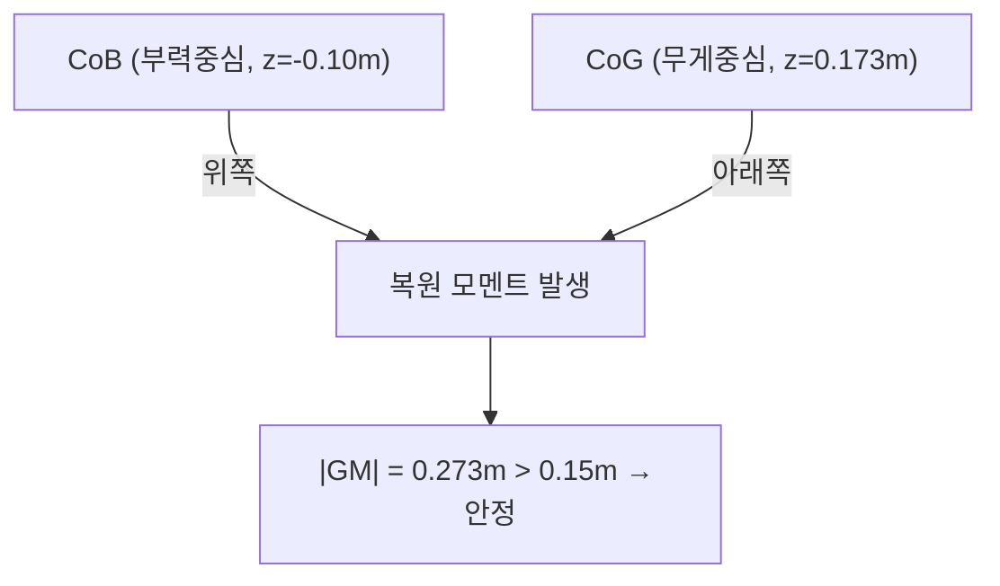
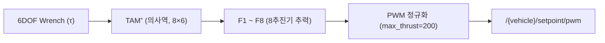

# 동역학·추력 배분 파라미터

이 페이지는 BlueROV2의 강체 동역학 파라미터(`dynamics_params.yaml`), 추력 배분 노드(`thruster_allocator_node.py`)의 파라미터, 그리고 8추진기 6DOF 추력 배분 행렬(`TAM.yaml`)의 구조를 정리한다.

## 동역학 파라미터 (`dynamics_params.yaml`)

`dynamics_params.yaml`은 BlueROV2의 질량·관성·부력 특성을 정의한다(`dynamics_params.yaml:1-143`). 시뮬레이터의 강체 동역학(질량·관성), 유체 항력, 부력 계산이 이 값에 의존한다.

| 파라미터 | 기본값 | 단위 | 의미 | 효과 |
|---------|--------|------|------|------|
| `mass` | `20.131` | kg | 차량 질량 | 가속/감속 응답, 추력 대비 운동량 결정 |
| `ixx` | `0.65` | kg·m² | Roll 축 관성 모멘트 | Roll 각가속 응답 |
| `iyy` | `0.65` | kg·m² | Pitch 축 관성 모멘트 | Pitch 각가속 응답 |
| `izz` | `0.13` | kg·m² | Yaw 축 관성 모멘트 | Yaw 각가속 응답(최소 → 빠른 선회) |
| `cog` | `[0, 0, 0.173]` | m | 무게중심(Center of Gravity) | 자세 안정성·복원 모멘트 기준점 |
| `cob` | `[0, 0, -0.10]` | m | 부력중심(Center of Buoyancy) | 메타센트릭 안정성 결정 |
| `volume` | `0.019582` | m³ | 배수 체적 | 부력 크기(\(F_b = \rho g V\)) |
| `density` | `1028` | kg/m³ | 유체 밀도(해수) | 부력·항력 계산 |
| `gravity` | `9.82` | m/s² | 중력 가속도 | 무게·부력 균형 |
| `length` | `0.457` | m | 차체 길이 | 외형/충돌·항력 기준 |
| `width` | `0.338` | m | 차체 폭 | 외형/충돌·항력 기준 |
| `height` | `0.254` | m | 차체 높이 | 외형/충돌·항력 기준 |

### 중성부력

`mass`(`20.131` kg), `volume`(`0.019582` m³), `density`(`1028` kg/m³)는 중성부력을 이루도록 설정되어 있다(`dynamics_params.yaml:1-143`). 즉 차량 무게와 부력이 균형을 이루어, 정지 상태에서 수직 추력 없이도 깊이를 유지한다. 부력은 다음으로 계산된다.

\[
F_b = \rho\, g\, V = 1028 \times 9.82 \times 0.019582
\]

!!! warning "중성부력 균형 깨짐 주의"
    `mass`, `volume`, `density` 중 하나만 바꾸면 무게-부력 균형이 깨져 차량이 가라앉거나 떠오른다. 한 값을 수정할 때는 다른 값들과의 균형을 함께 검토하라.

### 메타센트릭 안정성

`cog`는 차체 좌표계 기준 `[0, 0, 0.173]` m, `cob`는 `[0, 0, -0.10]` m에 위치한다. 부력중심(`cob`)이 무게중심(`cog`)보다 위에 있어야 복원 모멘트가 발생해 차량이 똑바로 선 자세로 복원된다. 분석상 메타센트릭 높이는 \(|GM| = 0.273\) m로, 안정 기준 \(0.15\) m를 넘어 안정적이다(`dynamics_params.yaml:1-143`).

!!! note "Yaw 관성이 작은 이유"
    `izz`(`0.13`)는 `ixx`/`iyy`(`0.65`)의 약 1/5로 가장 작다. Yaw 축 관성이 작으면 선회(heading) 응답이 빠르다. 이는 4DOF 제어에서 yaw 제어가 비교적 민첩하게 동작하는 물리적 배경이 된다.

### `gravity`가 9.81이 아닌 이유

`gravity`는 `9.82` m/s²로, 표준 중력 가속도 `9.81`이 아니다(`dynamics_params.yaml:1-143`).

!!! tip "9.82는 의도된 calibration 값"
    `9.82`는 오타가 아니라 의도된 calibration 값이다. 부력·무게 균형(중성부력)을 시뮬레이터 환경에 맞추기 위해 조정된 값이므로, "표준값으로 고치자"는 판단으로 `9.81`로 되돌리지 말 것. 이 값을 바꾸면 부력 균형이 미세하게 어긋나 중성부력 가정이 깨질 수 있다.

## 추력 배분 노드 파라미터 (`thruster_allocator_node.py`)

추력 배분 노드(`thruster_allocator` 노드, `thruster_allocator_node.py:39`)는 6DOF wrench를 8개 추진기의 개별 추력으로 변환한다. 노드 파라미터는 다음과 같다(`thruster_allocator_node.py:41-59`).

| 파라미터 | 기본값 | 의미 |
|---------|--------|------|
| `tam_file` | `''` | TAM 행렬 파일 경로(미지정 시 기본 동작) |
| `vehicle_name` | `'bluerov2'` | 차량 이름(네임스페이스) |
| `base_link` | `'base_link'` | 기준 링크 프레임 |
| `update_rate` | `50.0` | 배분 갱신 주기(Hz) |
| `timeout` | `1.0` | 입력 타임아웃(s) |
| `max_thrust` | `200.0` | PWM 정규화 척도(물리 한계 아님) |

!!! warning "`max_thrust`는 물리적 추력 한계가 아니다"
    `max_thrust`(`200.0`)는 추진기 출력을 PWM 신호로 정규화할 때 쓰는 척도이며, 물리적 최대 추력(N)이 아니다(`thruster_allocator_node.py:41-59`). 이 값을 실제 추력 한계로 해석하지 말 것.

추력 배분의 동작은 의사역(pseudo-inverse) 기반이다. 6DOF wrench를 입력받아 TAM의 의사역을 곱해 8개 추진기 추력 \(F_1 \sim F_8\)을 구하고, `max_thrust`로 PWM 정규화한 뒤 `Float64MultiArray` 형식으로 `/{vehicle}/setpoint/pwm`에 발행한다(`thruster_allocator_node.py`).

\[
\mathbf{F} = \mathrm{TAM}^{+} \cdot \boldsymbol{\tau}
\]

여기서 \(\mathrm{TAM}^{+}\)는 TAM 행렬의 의사역(numpy 계산), \(\boldsymbol{\tau}\)는 6DOF wrench다. 8추진기로 6DOF를 구동하므로 해는 과작동(redundant)이며, 의사역은 최소노름(minimum-norm) 해를 준다.

## 추력 배분 행렬 구조 (`TAM.yaml`)

`TAM.yaml`은 6×8 추력 배분 행렬(Thruster Allocation Matrix)을 정의한다(`TAM.yaml:1-52`). 행은 6DOF(`Surge`/`Sway`/`Heave`/`Roll`/`Pitch`/`Yaw`), 열은 8개 추진기(T1~T8)에 대응한다.

| 행 (DOF) | 의미 |
|----------|------|
| `Surge` | 전후 방향 힘 |
| `Sway` | 좌우 방향 힘 |
| `Heave` | 상하 방향 힘 |
| `Roll` | 좌우 기울임 모멘트 |
| `Pitch` | 앞뒤 기울임 모멘트 |
| `Yaw` | 선회 모멘트 |

추진기 배치는 수평 4개(T1~T4, 45° 배치)와 수직 4개(T5~T8)로 구성된다(`TAM.yaml:1-52`). 수평 추진기(45°)는 Surge·Sway·Yaw에, 수직 추진기는 Heave·Roll·Pitch에 기여한다. 8개 추진기로 6DOF를 구동하므로 8→6 과작동(redundant) 구조다.

각 행의 항목은 해당 추진기가 그 DOF에 기여하는 정도(부호 포함 계수)를 나타낸다. 행렬 전체 형상은 6행(DOF) × 8열(추진기)이다.

!!! note "과작동(redundant) 배분"
    추진기가 8개인데 제어 자유도는 6개이므로, 동일한 wrench를 만드는 추진기 조합이 무수히 많다. 의사역은 이 중 추력 노름이 최소인 해를 선택하므로, 추진기 출력이 불필요하게 커지지 않는다.

## 관련 파라미터 파일

동역학·추력 배분 외 다른 설정 파일은 다음과 같다(`5.4 설정 파일 위치`).

| 파일 | 역할 |
|------|------|
| `dynamics_params.yaml` | 동역학(질량·관성·부력) |
| `TAM.yaml` | 추력 배분 행렬 |
| `hybrid_controller.yaml` | 제어 게인 |
| `path_following.yaml` | 경로 추종 |
| `path_generator.yaml` | 경로 생성 |
| `*.scn` | 시나리오 |
