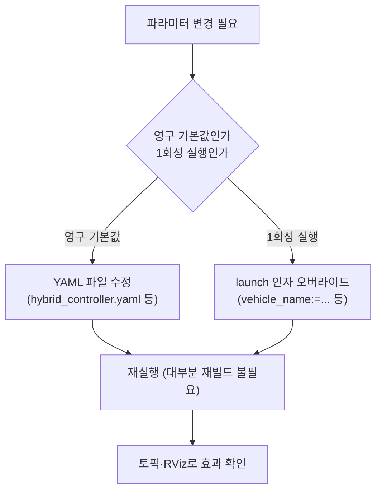

# 파라미터 개요와 사용법

이 페이지는 stonefish_sim의 동작을 바꾸는 파라미터를 **어디서·어떻게 수정하고**, 수정한 결과를 어떻게 확인하는지를 안내한다. 제어 게인부터 동역학·추력 배분·경로추종·경로생성·시나리오까지, 각 설정 파일의 용도와 오버라이드 방법, 그리고 수정 후 재빌드·재실행이 필요한지를 정리한다.

## 어디서 수정하나 — 설정 파일 위치

stonefish_sim의 파라미터는 패키지별 YAML 파일과 시나리오 `.scn` 파일에 흩어져 있다. 각 파일의 용도는 다음과 같다.

| 파일 | 무엇을 제어하나 | 관련 노드 |
|------|----------------|-----------|
| `hybrid_controller.yaml` | 4DOF 하이브리드 PID 제어 게인(velocity/position 모드별 `Kp`/`Kd`/`Ki`/`Kb`), 힘·토크 포화한계, 적분 안전계수 | `hybrid_controller` |
| `dynamics_params.yaml` | BlueROV2 동역학(`mass`, 관성 `ixx`/`iyy`/`izz`, `cog`/`cob`, `volume`, `density`, `gravity`, 치수) | 시뮬레이터 동역학 |
| `TAM.yaml` | 6×8 추력배분행렬(Thruster Allocation Matrix) — 8개 추진기의 Surge/Sway/Heave/Roll/Pitch/Yaw 기여 | `thruster_allocator` |
| `path_following.yaml` | ILOS/ALOS 경로추종 게인(`lookahead_distance`, `cruise_speed`, `integral_gain`, `curvature_gain` 등) | `path_following_4dof_node` |
| `path_generator.yaml` | 경로생성 보간(Cubic Spline / LIPB / Linear) 관련 설정 | `path_generator_4dof_node` |
| `*.scn` | 로봇·환경·센서·시나리오 정의(Stonefish XML). `stonefish_description/scenarios/`에 7개 | `stonefish_simulator` |

근거: 설정 파일 위치는 sim_analysis 5.4, 파라미터 정의는 `hybrid_controller_node.py:51-88`, `path_following_node.py:41-93`, `dynamics_params.yaml`, `TAM.yaml`.

!!! note "파라미터값의 SSOT는 코드 기본값이다"
    각 노드는 `declare_parameter()`로 코드에 기본값을 두고, YAML이 있으면 그 값으로 덮어쓴다. 즉 YAML에 명시하지 않은 항목은 코드 기본값이 그대로 적용된다. 예를 들어 `hybrid_controller`의 게인 기본값은 `hybrid_controller_node.py:55` 이후에, 오버라이드는 `hybrid_controller.yaml`에 정의된다.

각 파일의 항목별 의미·기본값·효과는 3개의 상세 레퍼런스 페이지에서 다룬다.

- [제어 게인](./control-gains.md) — `hybrid_controller.yaml`
- [경로 추종(ILOS)](./path-following.md) — `path_following.yaml`
- [동역학·추력 배분](./dynamics-tam.md) — `dynamics_params.yaml`, `TAM.yaml`

## 어떻게 수정하나 — 오버라이드 방식

파라미터를 바꾸는 경로는 두 갈래다. 영구적인 기본 설정은 **YAML 파일**을 고치고, 실행할 때 한 번만 바꾸려면 **launch 인자**를 넘긴다.



### YAML 오버라이드

ROS2 파라미터 YAML은 노드 이름 아래 `ros__parameters:` 블록에 키-값을 둔다. 노드 이름 대신 와일드카드 `/**:`를 쓰면 네임스페이스·노드 이름에 관계없이 적용된다.

```yaml
/**:
  ros__parameters:
    vehicle_name: "bluerov2"
    control_rate: 50.0
    velocity_mode:
      Kp: [200.0, 200.0, 250.0, 150.0]
      max_force: 800.0
```

!!! warning "wildcard /** 가 없으면 게인이 로드되지 않는다"
    `hybrid_controller.yaml`은 와일드카드 `/**:` 매칭에 의존한다. P4에서 수정된 결함(T1.2) 중 하나가 바로 **하이브리드 제어기 YAML이 로드되지 않던 wildcard 문제**였다(CHANGELOG v0.4.0 Fixed). YAML을 새로 만들 때 노드 이름이 정확히 맞지 않으면 값이 무시되고 코드 기본값이 쓰이므로, 게인을 바꿨는데 거동이 그대로라면 먼저 YAML이 실제로 로드됐는지 의심하라.

### launch 인자 오버라이드

launch 파일이 노출한 인자는 `이름:=값` 형태로 실행 시 덮어쓸 수 있다. 자주 쓰는 인자는 다음과 같다.

| launch | 주요 인자 | 예 |
|--------|-----------|-----|
| `vehicle.launch.py` | `vehicle_name`, `scenario`, `gpu`(true/false), `window_res_y`, `simulation_rate`, `enable_base_link_frd`, `start_thruster_manager` | `gpu:=false` 로 headless 시뮬 |
| `simulator.launch.py` | `gpu`, `window_res_x`/`window_res_y`, `rendering_quality`(low/medium/high) | `rendering_quality:=low` 로 렌더링 품질 낮춤 |
| `control.launch.py` | `vehicle_name`, `use_sim_time` | `vehicle_name:=bluerov2 use_sim_time:=false` |
| `bringup.launch.py` | `vehicle`, `use_sim_time`, `start_control`/`start_path`/`start_thruster_manager` | `vehicle:=bluerov2 use_sim_time:=true` |
| `path.launch.py` | `vehicle_name`, `use_sim_time`, `waypoint_file`, `interpolation_method`, `rviz` | `vehicle_name:=bluerov2 use_sim_time:=true` |

```bash
# 1회성: BlueROV2를 headless(nogpu)로 시뮬레이션
ros2 launch stonefish_ros2 vehicle.launch.py vehicle_name:=bluerov2 gpu:=false

# 전체 스택(시뮬+제어+경로+추력) 기동
ros2 launch stonefish_ros2 bringup.launch.py vehicle:=bluerov2 use_sim_time:=true
```

!!! note "`bluerov2.launch.py`는 얇은 래퍼다"
    `bluerov2.launch.py`/`blueboat.launch.py`는 `vehicle.launch.py`에 차량별 기본값(`scenario`, `window_res_y`, `enable_base_link_frd` 등)을 고정해 넘기는 얇은 래퍼라, 자체적으로 노출하는 오버라이드 인자가 사실상 없다. 렌더링 품질·해상도·gpu 같은 시뮬 인자를 바꾸려면 `vehicle.launch.py`(또는 `simulator.launch.py`)를 직접 호출한다.

근거: launch 인자는 sim_analysis 5.2 + 각 launch 파일의 `DeclareLaunchArgument`.

!!! tip "런타임 모드 전환은 토픽으로"
    `hybrid_controller`의 제어 모드(`velocity`/`position`)는 파라미터를 다시 로드하지 않고 `/{vehicle}/control_mode`(`std_msgs/String`) 토픽을 발행해 **즉시 절환**할 수 있다. 모드 전환 시 적분기는 리셋된다(sim_analysis 4.3). 게인 자체를 바꾸려면 YAML 수정 후 재실행이 필요하지만, 모드만 오가는 것은 실행 중에도 가능하다.

## 수정 후 재빌드·재실행이 필요한가

| 수정 대상 | 재빌드 | 재실행 | 비고 |
|-----------|--------|--------|------|
| YAML 값(게인·동역학·TAM·경로) | 보통 불필요 | 필요 | `--symlink-install` 빌드라면 설정 파일은 심볼릭 링크로 참조됨 |
| launch 인자 | 불필요 | 필요(인자는 기동 시점에 적용) | 노드를 새로 띄우면서 인자만 바꿈 |
| `control_mode` 토픽 | 불필요 | 불필요 | 실행 중 토픽 발행으로 즉시 반영 |
| Python 노드 코드 | `--symlink-install`이면 불필요 | 필요 | 심볼릭 링크 설치 시 소스 변경이 바로 반영 |
| C++ 소스(`stonefish_ros2`) | 필요 | 필요 | `colcon build` 후 `source install/setup.bash` |

!!! warning "재실행 전 반드시 source"
    빌드 후에는 `source install/setup.bash`를 다시 실행해야 새 설정이 환경에 반영된다(sim_analysis 5.1). `colcon build --symlink-install`를 쓰면 YAML·Python 변경은 재빌드 없이 재실행만으로 적용되지만, C++ 변경은 항상 재빌드가 필요하다.

```bash
# 워크스페이스 루트에서
colcon build --symlink-install
source install/setup.bash
```

## 수정 시 효과를 읽는 법

파라미터를 바꾼 뒤 거동이 어떻게 달라졌는지는 토픽 구독과 RViz로 확인한다.

**토픽으로 수치 확인.** 시뮬레이터는 `/{vehicle}/odometry`(`nav_msgs/Odometry`, 50Hz, NED 진실값)로 위치·속도를 발행하고, 경로추종 노드(ILOS)는 `/{vehicle}/cmd_pose`(`TrajectoryPoint`, 50Hz)로 만든 목표를 발행한다(sim_analysis 2.2). 게인을 바꾼 뒤 추종 오차가 줄었는지 보려면 목표(`cmd_pose`)와 실제(`odometry`)를 함께 본다.

```bash
ros2 topic echo /bluerov2/odometry
ros2 topic echo /bluerov2/cmd_pose
```

**RViz로 시각 확인.** `path.launch.py`에 `rviz:=true`를 주면 `path_visualization.rviz`를 함께 띄워 경로·현재위치·목표자세·TF 트리(`world_ned`, `base_link`, `base_link_frd`, `map`)를 보여준다(sim_analysis 5.5, `path.launch.py`의 `rviz` 인자 기본값은 false). 경로추종 게인을 바꾸면 RViz에서 수렴 곡선의 모양이 직접 보인다.

각 파라미터가 거동에 주는 영향의 방향은 다음과 같이 요약된다(상세는 각 레퍼런스 페이지 참조).

| 파라미터 | 키우면 | 줄이면 |
|----------|--------|--------|
| `velocity_mode.Kp` | 빠르고 반응적, 오버슈팅 위험 | 느리고 부드러움 |
| `position_mode.Ki` | 정상상태 오차 빨리 제거, 불안정 위험 | 안정적, 잔류 오차 |
| `lookahead_distance` | 부드럽지만 느린 수렴 | 빠른 수렴, 진동 위험 |
| `cruise_speed` | 직선 주행 빠름 | 직선 주행 느림 |
| `curvature_gain` | 커브에서 더 감속 | 커브에서 덜 감속 |
| `integral_gain`(ILOS κ) | 누적 횡오차 보정 강함 | 보정 약함 |

근거: 효과 방향은 sim_analysis 3.1·3.2, 4.3.

!!! note "YAML과 코드 기본값의 불일치 주의"
    P4_FLAGS에 기록된 미해결 이슈로, `hybrid_controller.yaml`의 일부 `max_force`/`max_torque` 값이 코드 기본값과 다르게 문서화된 사례가 있다(sim_analysis 3.1, P4_FLAGS 1). 게인을 바꿨는데 포화한계 때문에 효과가 가려질 수 있으니, 거동이 예상과 다르면 실제 로드된 값을 `ros2 param get`으로 확인하라.

```bash
# 노드에 실제로 들어간 파라미터 값 확인
ros2 param get /bluerov2/hybrid_controller velocity_mode.max_force
```
