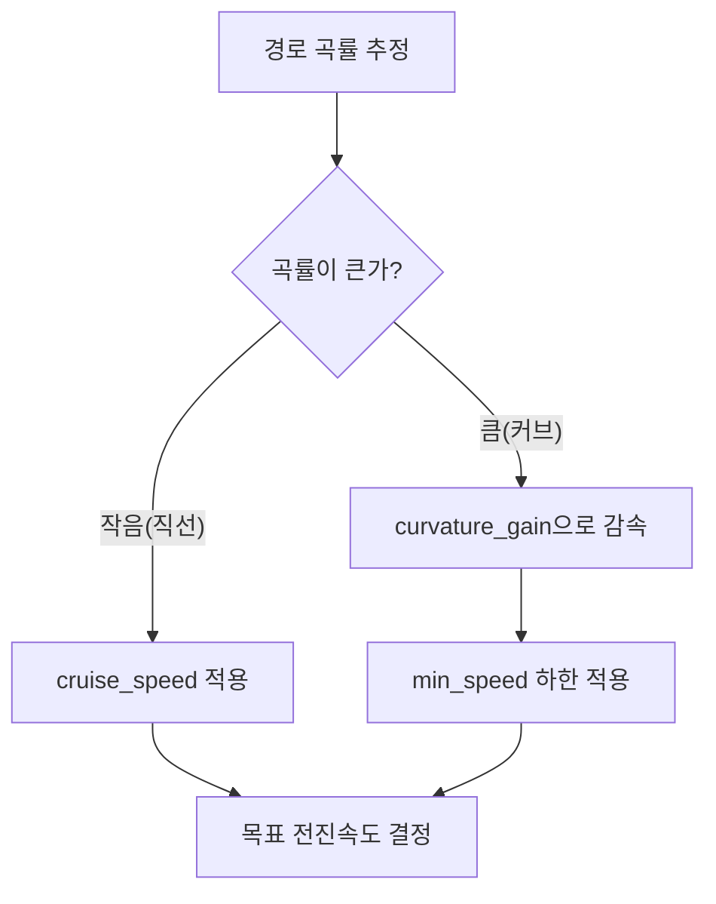

# 경로 추종(ILOS) 파라미터

이 페이지는 `path_following_4dof_node`(ILOS/ALOS 경로 추종 노드)가 선언하는 모든 ROS2 파라미터를 정의 위치(파일:라인)·`path_following.yaml` 키·의미·수정 효과와 함께 빠짐없이 정리한 레퍼런스다. 노드는 `stonefish_trajectory_manager` 패키지의 `nodes/path_following_node.py:39`에서 기동하며, 파라미터 선언은 `path_following_node.py:41-93`에 모여 있다.

이 노드는 경로 위 전방주시점(lookahead point)을 향하도록 차량의 heading을 만들고, 횡오차·곡률을 보정해 `/{vehicle}/cmd_pose`(`TrajectoryPoint`, 50Hz)로 목표 자세를 발행한다(`path_following_node.py:150`). 발행된 목표는 [하이브리드 제어기](../methodology/control.md)가 추력으로 변환한다. ILOS 유도법의 수학적 배경은 [ILOS 경로 추종](../methodology/guidance.md)을 참고하라.

## 파라미터 전체 표

표의 "정의"는 `path_following_node.py`의 라인 번호, "YAML"은 `path_following.yaml`의 라인 번호(`자동`은 YAML에 노출되지 않고 노드 기본값으로 결정됨, `-`는 YAML에 키가 없음)다.

| 파라미터 | 기본값 | 정의 | YAML | 의미 | 수정 효과 |
|---------|--------|------|------|------|----------|
| `vehicle_name` | `'bluerov2'` | `:42` | `:10` | 차량 이름(네임스페이스) | 토픽·TF 네임스페이스가 바뀜 |
| `update_rate` | `50.0` | `:43` | `-` | 유도 갱신 주파수(Hz) | 높이면 목표 자세 갱신이 잦아짐 |
| `lookahead_distance` | `3.0` | `:46` | `:20` | LOS 전방주시거리 \(\Delta\)(m) | 크면 수렴이 부드럽고 느려짐, 작으면 빠르지만 진동 위험 |
| `integral_gain` | `0.05` | `:47` | `:43` | ILOS 적분게인 \(\kappa\) | 크면 누적 횡오차 보정이 빨라짐, 과하면 진동 |
| `integral_limit` | `5.0` | `:48` | `-` | 적분항 상한(m) | 적분 누적(windup) 한계를 제한 |
| `lateral_gain` | `0.5` | `:49` | `:26` | 횡오차 비례(P) 게인 | 크면 횡오차에 더 강하게 반응 |
| `depth_gain` | `0.8` | `:50` | `자동` | 깊이오차 비례 게인 | 크면 깊이오차 보정이 강해짐 |
| `lateral_kd` | `0.3` | `:53` | `자동` | 횡오차 미분(D) 게인 | 크면 횡 진동을 더 감쇠 |
| `depth_kd` | `0.5` | `:54` | `자동` | 깊이오차 미분 게인 | 크면 깊이 진동을 더 감쇠 |
| `max_lateral_velocity` | `0.5` | `:57` | `:46` | 횡속도 한계(m/s) | 횡방향 보정 속도의 상한 |
| `max_heave_velocity` | `0.4` | `:58` | `:47` | 수직속도 한계(m/s) | 깊이 보정 속도의 상한 |
| `cruise_speed` | `0.5` | `:61` | `:17` | 직선 구간 주행속도(m/s, 약 1knot) | 직선 목표 전진속도 |
| `min_speed` | `0.2` | `:62` | `:29` | 커브 최소속도(m/s) | 커브에서 떨어지는 속도의 하한 |
| `curvature_gain` | `2.0` | `:63` | `:23` | 곡률 기반 속도 저감 계수 | 크면 커브에서 더 많이 감속 |
| `heading_align_threshold` | `10.0` | `:66` | `자동` | 초기 heading 정렬 임계(도) | 시작 시 정렬 판정 각도 |
| `use_alos` | `False` | `:69` | `:36` | ALOS vs ILOS 선택 | `false`면 ILOS, `true`면 ALOS 유도 사용 |
| `adaptive_lookahead` | `True` | `:72` | `:39` | 곡률 기반 동적 전방주시 | `true`면 곡률에 따라 \(\Delta\)를 자동 조정 |

## 핵심 파라미터별 동작

`lookahead_distance`, `cruise_speed`, `curvature_gain`, `integral_gain`이 경로 추종 거동을 가장 크게 좌우한다.

`lookahead_distance`(\(\Delta\))는 차량이 바라보는 경로 위 전방 지점까지의 거리다. ILOS heading 명령은 \(\chi_d = \chi_{path} + \arctan(-e_y/\Delta) - \arctan(\kappa_{ILOS} \int e_y\,dt / \Delta)\) 형태로 계산되므로(`methodology/guidance.md` 참고), \(\Delta\)가 분모에 들어가 수렴 속도와 부드러움을 동시에 지배한다.

`cruise_speed`는 직선 구간의 목표 전진속도이며, 커브에서는 `curvature_gain`과 곡률에 따라 `min_speed`까지 감속한다. 즉 직선에서는 `cruise_speed`, 곡률이 클수록 `min_speed`에 가까워지는 식으로 속도가 자동 조절된다.

`integral_gain`(\(\kappa\))은 누적된 횡오차를 보정하는 ILOS 적분항의 강도이며, `integral_limit`이 그 누적의 상한을 막는다.

## 속도 조절 흐름

직선·커브에 따라 목표 속도가 어떻게 결정되는지를 요약하면 다음과 같다.



## 튜닝 가이드

!!! tip "전방주시거리(lookahead) 튜닝"
    `lookahead_distance`를 크게 하면 경로 수렴이 부드러워지지만 수렴이 느려진다. 작게 하면 빠르게 경로로 붙지만 진동(overshoot/지그재그) 위험이 커진다. `adaptive_lookahead`가 `True`면 곡률에 따라 이 값이 동적으로 조정되므로, 수동으로 `lookahead_distance`만 바꿔도 곡선 구간에서는 효과가 달라질 수 있다.

!!! tip "커브 감속(curvature_gain) 튜닝"
    `curvature_gain`을 크게 하면 곡률이 큰 커브에서 더 많이 감속한다. 감속의 하한은 `min_speed`이고, 직선에서의 목표 속도는 `cruise_speed`다. 커브에서 코너를 크게 도는(언더슈팅) 경향이면 `curvature_gain`을 키워 더 감속시키고, 너무 느리면 줄인다.

!!! tip "횡오차 보정(integral/lateral) 튜닝"
    `lateral_gain`은 횡오차에 대한 즉각적 비례 반응, `integral_gain`(\(\kappa\))은 정상상태 횡오차(편류 등 누적 오차)의 보정을 담당한다. 정상상태에서 경로 옆으로 일정하게 치우치면 `integral_gain`을 키운다. 단 적분항이 과하면 진동하므로 `integral_limit`으로 누적 상한을 둔다. 횡 진동이 심하면 `lateral_kd`(D 게인)를 키워 감쇠한다.

!!! note "ALOS vs ILOS 선택"
    `use_alos`가 `False`(기본값)면 ILOS 유도(`ilos_guidance.py`)를 사용한다. 두 유도법의 차이는 [ILOS 경로 추종](../methodology/guidance.md)에서 다룬다.

!!! warning "YAML에 없는 파라미터"
    표의 "YAML"이 `자동` 또는 `-`인 파라미터(`depth_gain`, `lateral_kd`, `depth_kd`, `heading_align_threshold`, `update_rate`, `integral_limit`)는 `path_following.yaml`에 키가 노출되어 있지 않다. 값을 바꾸려면 YAML에 해당 키를 추가하거나 노드 기본값을 직접 수정해야 한다.

## 설정 파일 위치

경로 추종 파라미터는 `path_following.yaml`에 정의된다. 경로 추종 노드는 `path.launch.py`로 기동한다.

```bash
ros2 launch stonefish_trajectory_manager path.launch.py vehicle_name:=bluerov2 use_sim_time:=true
```

제어 게인 파라미터는 별도 페이지 [제어 게인](control-gains.md)에서, 전체 파라미터 사용법은 [개요와 사용법](index.md)에서 다룬다.
